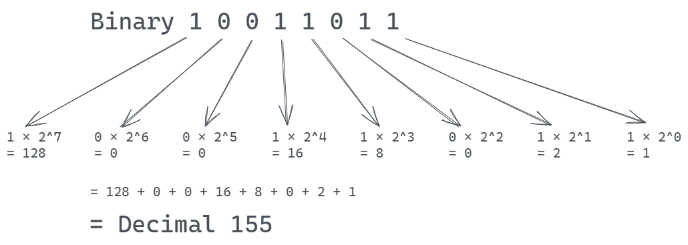

<h1 align="center">BIT MANIPULATION </h1>

  

----

| Problems                  | Solution                         |
| -------------             |:-------------:                   |
| BASIC OPERAIONS     | [BASIC.PY](https://github.com/aditya-2703/DSA/blob/main/BIT_MANIPULATION/BASICS.PY)              |
| BIT DIFFERENCE PROBLEM       | [BIT_DIFFERENCE.PY](https://github.com/aditya-2703/DSA/blob/main/BIT_MANIPULATION/BIT_DIFFERENCE.PY)        |   
| BINARY TO GREY CODE EQUIVALENCE | [Binary_To_Gray_Code_equivalent.PY](https://github.com/aditya-2703/DSA/blob/main/BIT_MANIPULATION/Binary_To_Gray_Code_equivalent.py)     | 
| CHECK K BIT| [CHECK_K_BIT.PY](https://github.com/aditya-2703/DSA/blob/main/BIT_MANIPULATION/CHEKC_K_BIT.PY)       |  
| FIND FIRST SET BIT     | [FIND_FIRST_SET_BIT.PY](https://github.com/aditya-2703/DSA/blob/main/BIT_MANIPULATION/FIND_FIRST_SET_BIT.PY)        |  
| IS POWER OF TWO    | [IS_POWER_2.PY](https://github.com/aditya-2703/DSA/blob/main/BIT_MANIPULATION/IS_POWER_2.PY)        |  
| NUMBER IS SPARSE OR NOT    | [Number_is_sparse_or_not.PY](https://github.com/aditya-2703/DSA/blob/main/BIT_MANIPULATION/Number_is_sparse_or_not.py)                 | 
| SWAPP ALL ODD AND EVEN BITS| [Swap_all_odd_and_even_bits.py](https://github.com/aditya-2703/DSA/blob/main/BIT_MANIPULATION/Swap_all_odd_and_even_bits.py)                 |   
| COUNT TOTAL SET BITS   | [Count_total_set_bits.PY](https://github.com/aditya-2703/DSA/blob/main/BIT_MANIPULATION/Count_total%20_set_bits.py)        |  
| MAXIMUM SUBSET XOR     | [Maximum_subset_XOR.PY](https://github.com/aditya-2703/DSA/blob/main/BIT_MANIPULATION/Maximum_subset_XOR.py)                 | 
| RIGHTMOST DIFFERENT BIT| [Rightmost_different_bit.py](https://github.com/aditya-2703/DSA/blob/main/BIT_MANIPULATION/Rightmost_different_bit%20.py)                 |   
| EQUAL SUM AND XOR     | [EQUAL_SUM_AND_XOR.PY](https://github.com/aditya-2703/DSA/blob/main/BIT_MANIPULATION/EQUAL_SUM_AND_XOR.PY)        |  
| LONGEST CONSICUTIVE ONE'S    | [LONGEST_CONSECUTIVE_1'S.PY](https://github.com/aditya-2703/DSA/blob/main/BIT_MANIPULATION/LONGEST_CONSECUTIVE_1'S.PY)                 | 
| MIDORI AND CHOCOLATE PROBLEM | [MIDORI_AND_CHOCOLATE.py](https://github.com/aditya-2703/DSA/blob/main/BIT_MANIPULATION/MIDORI_AND_CHOCOLATE.PY)                 |   
| NON REPEATING TWO DUPLICATE VALUES   | [NON_REPEATING_NUMBERS.PY](https://github.com/aditya-2703/DSA/blob/main/BIT_MANIPULATION/NON_REPEATING_NUMBERS.PY)        |  
| PARTY COUPLE PROBLEM (ONE DUPLICATE)     | [PARTY_OF_COUPLE.PY](https://github.com/aditya-2703/DSA/blob/main/BIT_MANIPULATION/PARTY_OF_COUPLE.PY)                 | 
