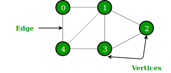

<h1 align="center">GRAPH</h1>

  

----

| Problems                  | Solution                         |
| -------------             |:-------------:                   |
| GRAPH CREATION SET     | [GRAPH_CREATION_SET.PY](https://github.com/aditya-2703/DSA/blob/main/GRAPH/GRAPH_CREATION_SET.PY)              |
| GRAPH CREATION LIST | [GRAPH_CREATION_ADJ.PY](https://github.com/aditya-2703/DSA/blob/main/GRAPH/GRAPH_CREATION_ADJ.PY)        |   
| GRAPH CREATION MATRIX | [GRAPH_CREATION_MAT.PY](https://github.com/aditya-2703/DSA/blob/main/GRAPH/GRAPH_CREATION_MAT.PY)        |   
| DFS          | [DFS.PY](https://github.com/aditya-2703/DSA/blob/main/GRAPH/DFS.PY)        |   
| GET CONNECTED COMPONENTS          | [GET_CONNECTED_COMPO.PY](https://github.com/aditya-2703/DSA/blob/main/GRAPH/GET_CONNECTED_COMPO.PY)        |   
| IS GRAPH CONNECTED          | [IS_GRAPH_CONNECTED.PY](https://github.com/aditya-2703/DSA/blob/main/GRAPH/IS_GRAPH_CONNECTED.PY)        |   
| GET NUMBER OF ISLANDS          | [COUNT_NO_OF_ISLAND.PY](https://github.com/aditya-2703/DSA/blob/main/GRAPH/COUNT_NO_OF_ISLAND.PY)        |   
| BFS     | [BFS.PY](https://github.com/aditya-2703/DSA/blob/main/GRAPH/BSF.PY)              |
| DIJSTRA'S ALGORITHM   | [DIJSKRA'S.PY](https://github.com/aditya-2703/DSA/blob/main/GRAPH/DIJSKRA'S.PY)     | 
| KRUSKAL'S ALGORITHM| [KRUSKAL'S.PY](https://github.com/aditya-2703/DSA/blob/main/GRAPH/KRUSKAL'S.PY)       |  
| PRIM'S ALGORITHM| [PRIM'S.PY](https://github.com/aditya-2703/DSA/blob/main/GRAPH/PRIM'S.PY)        |  
| FLOYD WARSHAL    | [floyd_warshal.PY](https://github.com/aditya-2703/DSA/blob/main/GRAPH/floyd_warshal.py)        |  
