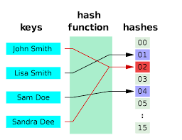

<h1 align="center">HASHMAP</h1>

  

----

| Problems                                  | Solution                         | Platform        |
| :-------------                            |:-------------                    | :-------------  |                 
| AFTER COLLISION HASHING                   | [Solution](https://github.com/aditya-2703/DSA/blob/main/HASHMAP/ACO_HASH_FUNCTION.PY)                         | [GFG](https://www.geeksforgeeks.org/implementing-our-own-hash-table-with-separate-chaining-in-java/) | 
| BEFORE COLLISION HASHING                  | [Solution](https://github.com/aditya-2703/DSA/blob/main/HASHMAP/BCO_HASH_FUNCTION.PY)                         | [GFG](https://www.geeksforgeeks.org/implementing-our-own-hash-table-with-separate-chaining-in-java/) |
| COUNT DISTINCT ELEMENT IN EVERY WINDOW    | [Solution](https://github.com/aditya-2703/DSA/blob/main/HASHMAP/Count_distinct_elements_in_every_window.py)   | [GFG](https://www.geeksforgeeks.org/count-distinct-elements-in-every-window-of-size-k/) |   
| INTERSECTION OF TWO SORTED ARRAY          | [Solution](https://github.com/aditya-2703/DSA/blob/main/HASHMAP/INTERSECTION_OF_2_SORTED_ARR.py)              | [GFG](https://www.geeksforgeeks.org/union-and-intersection-of-two-sorted-arrays-2/) | 
| LONGEST CONSICUTIVE                       | [Solution](https://github.com/aditya-2703/DSA/blob/main/HASHMAP/LONGEST_CONSICUTIVE.PY)                       | [LEETCODE](https://leetcode.com/problems/longest-consecutive-sequence/) |  
| LONGEST SUBARRAY WITH ZERO SUM            | [Solution](https://github.com/aditya-2703/DSA/blob/main/HASHMAP/LONGEST_SUBARR_0_SUM.PY)                      | [LEETCODE](https://leetcode.com/problems/maximum-subarray/) |  
| MAXIMUM DISTANCE BETWEEN SAME ELEMENT     | [Solution](https://github.com/aditya-2703/DSA/blob/main/HASHMAP/MAX_DIS_BET_SAME_ELE.PY)                      | [GFG](https://www.geeksforgeeks.org/maximum-distance-two-occurrences-element-array/#:~:text=A%20simple%20solution%20for%20this,is%20O(n2).) |  
| NON REPEAT                                | [Solution](https://github.com/aditya-2703/DSA/blob/main/HASHMAP/NON_REPEAT.PY)                                | [GFG](https://www.geeksforgeeks.org/non-repeating-element/) |  
| SORTING ELEMENT OF AN ARRAY BY FREQUENCY  | [Solution](https://github.com/aditya-2703/DSA/blob/main/HASHMAP/Sorting_Elements_of_an_Array_by_Frequency.py) | [LEETCODE](https://leetcode.com/problems/sort-array-by-increasing-frequency/) |  
| TOP K FREQUENT ELEMENT IN ARRAY           | [Solution](https://github.com/aditya-2703/DSA/blob/main/HASHMAP/Top_K_Frequent_Elements_in_Array.py)          | [GFG](https://www.geeksforgeeks.org/find-k-numbers-occurrences-given-array/) |  
| IS TWO ARRAY SAME OR NOT                  | [Solution](https://github.com/aditya-2703/DSA/blob/main/HASHMAP/TWO_ARR_SAME_OR_NOT.PY)                       | [GFG](https://www.geeksforgeeks.org/check-if-two-arrays-are-equal-or-not/#:~:text=Two%20arrays%20are%20said%20to,two%20arrays%20to%20be%20equal.) |  

