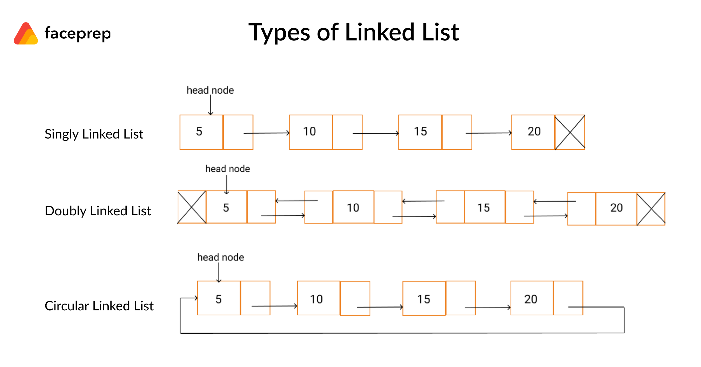

<h1 align="center" >LINKED LIST</h1>

  

----

| Problems                  | Solution                         |
| -------------             |:-------------:                   |
| LINKED LIST     | [LINKED_LIST.PY](https://github.com/aditya-2703/DSA/blob/main/LINKED_LIST/LINKED_LIST.py)              |
| DOUBLY LINKED LIST          | [DOUBLY_LINKED_LIST.PY](https://github.com/aditya-2703/DSA/blob/main/LINKED_LIST/DOUBLY_LINKED_LIST.py)        |   
| CIRCULAR LINKED LIST  | [CIRCULAR_SINGLY_LINKED_LIST.PY](https://github.com/aditya-2703/DSA/blob/main/LINKED_LIST/CIRCULAR_SINGLY_LINKED_LIST.py)     | 
| CIRCULAR DOUBLY LINKED LIST  | [CIRCULAR_DOUBLY_LINKED_LIST.PY](https://github.com/aditya-2703/DSA/blob/main/LINKED_LIST/CIRCULAR_DOUBLY_LINKED_LIST.PY)     | 
| REVERSE A LINKED LIST| [REVERSELINKEDLIST.PY](https://github.com/aditya-2703/DSA/blob/main/LINKED_LIST/REVERSELINKEDLIST.py)       |  
| ROTATE A LINKED LIST IN K TIMES | [ROTATE_A_LINKED_LIST.PY](https://github.com/aditya-2703/DSA/blob/main/LINKED_LIST/ROTATE_A_LINKED_LIST.py)       |  
| PAIR SWAP| [PAIR_SWAP.PY](https://github.com/aditya-2703/DSA/blob/main/LINKED_LIST/PAIR_SWAP.PY)        |  
| MERGED  TWO SORTED LINKED LIST    | [MERGED_TWO_SORTED_ARR.PY](https://github.com/aditya-2703/DSA/blob/main/LINKED_LIST/MERGED_TWO_SORTED_ARR.PY)        |  
