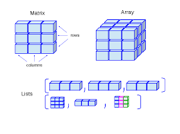

<h1 align="center">MATRIX</h1>

  

| Problems                       | Solution                         | Platform                   |
| :-------------                 |:-------------                   | :-------------             |
| ADDITION OF TWO MATRIX         | [Solution](https://github.com/aditya-2703/DSA/blob/main/MATRIX/ADDITION_TWO_MAT.PY)     | [GFG](https://www.geeksforgeeks.org/program-addition-two-matrices/) |
| BOOLEAN MATRIX                 | [Solution](https://github.com/aditya-2703/DSA/blob/main/MATRIX/BOOLEAN_MATRIX.PY)       | [GFG](https://www.geeksforgeeks.org/a-boolean-matrix-question/) |   
| DETERMINATION OF TWO MATRIX    | [Solution](https://github.com/aditya-2703/DSA/blob/main/MATRIX/DETERMINATION_TWO_MAT.PY)| [GFG](https://www.geeksforgeeks.org/determinant-of-a-matrix/) | 
| MAX SUM OF 1'S                 | [Solution.PY](https://github.com/aditya-2703/DSA/blob/main/MATRIX/MAX_SUM_1'S.PY)       | [GFG](https://www.geeksforgeeks.org/maximum-size-sub-matrix-with-all-1s-in-a-binary-matrix/) |  
| MULTIPLICATION OF TWO MATRIX   | [Solution](https://github.com/aditya-2703/DSA/blob/main/MATRIX/MUL_TWO_MAT.PY)          | [GFG](https://www.geeksforgeeks.org/c-program-multiply-two-matrices/) | 
| ROTATE MATRIX 90 DEGREE        | [Solution](https://github.com/aditya-2703/DSA/blob/main/MATRIX/ROTATE_90_DEG.PY)        | [GFG](https://www.geeksforgeeks.org/inplace-rotate-square-matrix-by-90-degrees/) |   
| SEARCH IN MATRIX               | [Solution](https://github.com/aditya-2703/DSA/blob/main/MATRIX/SEARCH_IN_MATRIX.PY)     | [LEETCODE](https://leetcode.com/problems/search-a-2d-matrix/) |  
| SPIRAL TRAVERSAL IN MATRIX     | [Solution](https://github.com/aditya-2703/DSA/blob/main/MATRIX/SPIRAL_TRAVERSAL.PY)     | [LEETCODE](https://leetcode.com/problems/spiral-matrix/) |    
| TRANSPOSE OF MATRIX            | [Solution](https://github.com/aditya-2703/DSA/blob/main/MATRIX/TRANSPOSE_MATRIX.PY)     | [GFG](https://www.geeksforgeeks.org/program-to-find-transpose-of-a-matrix/) |    
