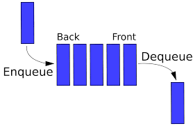
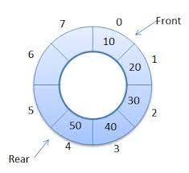

<h1 align="center">QUEUE</h1> 
  
  

  

| Problems                  | Solution                         | Platform           |
| :-------------             |:-------------                   | :-------------     |
| QUEUE                     | [Solution](https://github.com/aditya-2703/DSA/blob/main/QUEUE/QUEUE.PY)                   |  |
| QUEUE WITH LINKED LIST    | [Solution](https://github.com/aditya-2703/DSA/blob/main/QUEUE/QUEUE_WITH_LINKED_LIST.PY)  | [GFG](https://www.geeksforgeeks.org/queue-linked-list-implementation/) |   
| CIRCULAR QUEUE            | [Solution](https://github.com/aditya-2703/DSA/blob/main/QUEUE/CIRCULAR_QUEUE.PY)          | [GFG](https://www.geeksforgeeks.org/circular-queue-set-1-introduction-array-implementation/#:~:text=Circular%20Queue%20is%20a%20linear,also%20called%20'Ring%20Buffer'.&text=In%20a%20circular%20queue%2C%20the,always%20inserted%20at%20Rear%20position.) | 
| PRIORITY QUEUE            | [Solution](https://github.com/aditya-2703/DSA/blob/main/QUEUE/PRIORITY_QUEUE.py)          | [GFG](https://www.geeksforgeeks.org/priority-queue-set-1-introduction/) |  
| DOUBLE ENDED QUEUE        | [Solution](https://github.com/aditya-2703/DSA/blob/main/QUEUE/DOUBLE_ENDED_QUEUE.PY)      | [GFG](https://www.geeksforgeeks.org/deque-set-1-introduction-applications/) |
| SLIDING WINDOW MAXIMUM    | [Solution](https://github.com/aditya-2703/DSA/blob/main/QUEUE/SLIDING_WINDOW_MAX.PY)      | [GFG](https://www.geeksforgeeks.org/sliding-window-maximum-maximum-of-all-subarrays-of-size-k/) |
