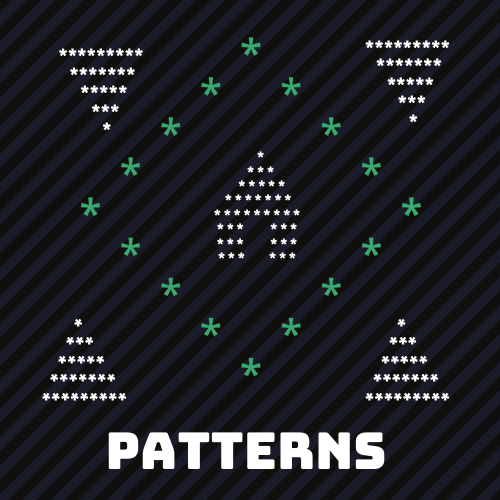
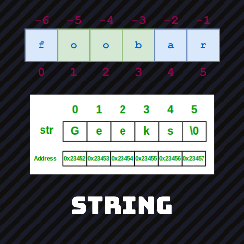
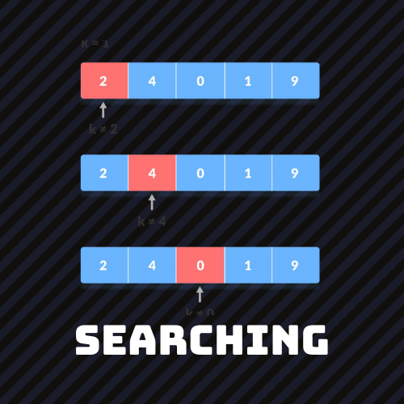
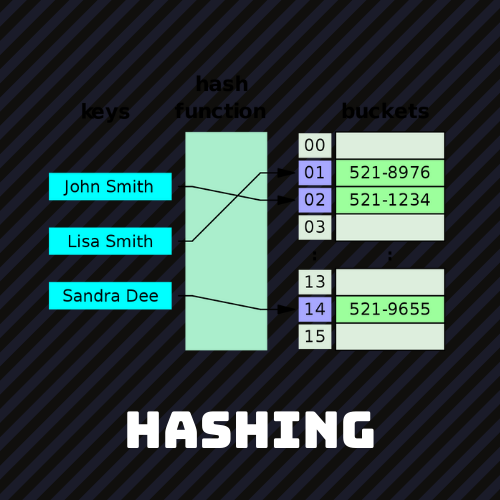
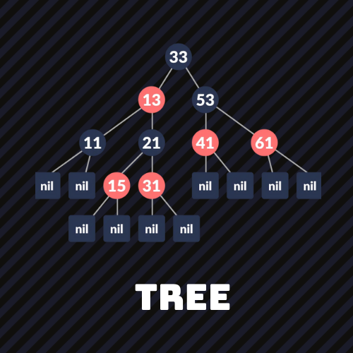

  

# Topics 
----

|    [PATTERN](https://github.com/aditya-2703/DSA/tree/main/PATTERN) |    [MATHS](https://github.com/aditya-2703/DSA/tree/main/MATHS)  |    [BIT MAGIC](https://github.com/aditya-2703/DSA/tree/main/BIT_MANIPULATION) |    [ARRAY](https://github.com/aditya-2703/DSA/tree/main/ARRAY) |
| ------ | ------ | ------ | ------ | 
|    [STRING](https://github.com/aditya-2703/DSA/tree/main/STRING) |    [MATRIX](https://github.com/aditya-2703/DSA/tree/main/MATRIX)  |    [SORTING](https://github.com/aditya-2703/DSA/tree/main/sorting) |    [SEARCHING](https://github.com/aditya-2703/DSA/tree/main/searching) |
|    [HASHING](https://github.com/aditya-2703/DSA/tree/main/HASHMAP)  |    [STACK](https://github.com/aditya-2703/DSA/tree/main/STACK)   |    [QUEUE](https://github.com/aditya-2703/DSA/tree/main/QUEUE)  |    [LINKED LIST](https://github.com/aditya-2703/DSA/tree/main/LINKED_LIST)  |
|    [RECURSION](https://github.com/aditya-2703/DSA/tree/main/RECURSION)  |    [BACKTRACKING](https://github.com/aditya-2703/DSA/tree/main/backtraking)   |    [TREE](https://github.com/aditya-2703/DSA/tree/main/TREE)  |    [GRAPH](https://github.com/aditya-2703/DSA/tree/main/GRAPH)  |
|    [GREEDY](https://github.com/aditya-2703/DSA/tree/main/greedy)  |    [DIVIDE AND CONQURE](https://github.com/aditya-2703/DSA/tree/main/divide_and_conqure)   |    [DP](https://github.com/aditya-2703/DSA/tree/main/dynamic_programming)  |  |

----
# PATTERNS

| Qn        | Solution           | Qn 		| Solution
| :-------------: |:-------------:| :-------------: |:-------------:| 
| 1.PY |[1.PY](https://github.com/aditya-2703/DSA/blob/main/PATTERN/1.PY)           | 18.PY |[18.PY](https://github.com/aditya-2703/DSA/blob/main/PATTERN/18.PY)        | 
| 2.PY |[2.PY](https://github.com/aditya-2703/DSA/blob/main/PATTERN/2.PY)           | 19.PY |[19.PY](https://github.com/aditya-2703/DSA/blob/main/PATTERN/19.PY)        | 
| 3.PY |[3.PY](https://github.com/aditya-2703/DSA/blob/main/PATTERN/3.PY)           | 20.PY |[20.PY](https://github.com/aditya-2703/DSA/blob/main/PATTERN/20.PY)        | 
| 4.PY |[4.PY](https://github.com/aditya-2703/DSA/blob/main/PATTERN/4.PY)           | 21.PY |[21.PY](https://github.com/aditya-2703/DSA/blob/main/PATTERN/21.PY)        | 
| 5.PY |[5.PY](https://github.com/aditya-2703/DSA/blob/main/PATTERN/5.PY)           | 22.PY |[22.PY](https://github.com/aditya-2703/DSA/blob/main/PATTERN/22.PY)        |   
| 6.PY |[6.PY](https://github.com/aditya-2703/DSA/blob/main/PATTERN/6.PY)           | 23.PY |[23.PY](https://github.com/aditya-2703/DSA/blob/main/PATTERN/23.PY)        |   
| 7.PY |[7.PY](https://github.com/aditya-2703/DSA/blob/main/PATTERN/7.PY)           | 24.PY |[24.PY](https://github.com/aditya-2703/DSA/blob/main/PATTERN/24.PY)        | 
| 8.PY |[8.PY](https://github.com/aditya-2703/DSA/blob/main/PATTERN/8.PY)           | 25.PY |[25.PY](https://github.com/aditya-2703/DSA/blob/main/PATTERN/25.PY)        | 
| 9.PY |[9.PY](https://github.com/aditya-2703/DSA/blob/main/PATTERN/9.PY)           | 26.PY |[26.PY](https://github.com/aditya-2703/DSA/blob/main/PATTERN/26.PY)        | 
| 10.PY |[10.PY](https://github.com/aditya-2703/DSA/blob/main/PATTERN/10.PY)        | 27.PY |[27.PY](https://github.com/aditya-2703/DSA/blob/main/PATTERN/27.PY)        | 
| 11.PY |[11.PY](https://github.com/aditya-2703/DSA/blob/main/PATTERN/11.PY)        | 28.PY |[28.PY](https://github.com/aditya-2703/DSA/blob/main/PATTERN/28.PY)        | 
| 12.PY |[12.PY](https://github.com/aditya-2703/DSA/blob/main/PATTERN/12.PY)        | 29.PY |[29.PY](https://github.com/aditya-2703/DSA/blob/main/PATTERN/29.PY)        | 
| 13.PY |[13.PY](https://github.com/aditya-2703/DSA/blob/main/PATTERN/13.PY)        | 30.PY |[30.PY](https://github.com/aditya-2703/DSA/blob/main/PATTERN/30.PY)        |  
| 14.PY |[14.PY](https://github.com/aditya-2703/DSA/blob/main/PATTERN/14.PY)        | 31.PY |[31.PY](https://github.com/aditya-2703/DSA/blob/main/PATTERN/31.PY)        |  
| 15.PY |[15.PY](https://github.com/aditya-2703/DSA/blob/main/PATTERN/15.PY)        | 32.PY |[32.PY](https://github.com/aditya-2703/DSA/blob/main/PATTERN/32.PY)        |  
| 16.PY |[16.PY](https://github.com/aditya-2703/DSA/blob/main/PATTERN/16.PY)        | 33.PY |[33.PY](https://github.com/aditya-2703/DSA/blob/main/PATTERN/33.PY)        | 
| 17.PY |[17.PY](https://github.com/aditya-2703/DSA/blob/main/PATTERN/17.PY)        | 34.PY |[34.PY](https://github.com/aditya-2703/DSA/blob/main/PATTERN/34.PY)        | 
| 35.PY |[35.PY](https://github.com/aditya-2703/DSA/blob/main/PATTERN/35.PY)        | 36.PY |[36.PY](https://github.com/aditya-2703/DSA/blob/main/PATTERN/36.PY)        |

# MATH

| Problems              | Solution                         | Platform |
| :-------------        | :-------------                   | :-------------                   
| ABSOLUTE VALUE        | [Solution](https://github.com/aditya-2703/DSA/blob/main/MATHS/ABSOLUTE_VAL.PY)              |     |
| ADDITION UNDER MODULE | [Solution](https://github.com/aditya-2703/DSA/blob/main/MATHS/ADDITION_UNDER_MOD.PY)        |  [GFG](https://www.geeksforgeeks.org/modulo-1097-1000000007/)   |
| CELCUISE TO FERENHITE | [Solution](https://github.com/aditya-2703/DSA/blob/main/MATHS/CELCUISE_TO_FERENHITE.PY)     |  [GFG](https://www.geeksforgeeks.org/python-program-to-convert-celsius-to-fahrenheit/)  |     
| DIGIT COUNT PROBLEM   | [Solution](https://github.com/aditya-2703/DSA/blob/main/MATHS/DIGIT_COUNT_PROBLEM.PY)       |  [GFG](https://www.geeksforgeeks.org/program-count-digits-integer-3-different-methods/)   |      
| DIGIT IN FACTORIAL    | [Solution](https://github.com/aditya-2703/DSA/blob/main/MATHS/DIGIT_IN_FACTORIAL.PY)        |  [GFG](https://www.geeksforgeeks.org/count-digits-factorial-set-1/)   |      
| EXACTLY THREE DEVISOR | [Solution](https://github.com/aditya-2703/DSA/blob/main/MATHS/EXACTLY_3_DIVISIOR.PY)        |  [GFG](https://www.geeksforgeeks.org/numbers-exactly-3-divisors/)   |      
| FIND FACOTRIAL        | [Solution](https://github.com/aditya-2703/DSA/blob/main/MATHS/factorial.py)                 |  [GFG](https://www.geeksforgeeks.org/find-divisors-natural-number-set-1/)   |     
| FIND FIBONACCI        | [Solution](https://github.com/aditya-2703/DSA/blob/main/MATHS/fibonacci.py)                 |  [GFG](https://www.geeksforgeeks.org/program-for-nth-fibonacci-number/)   |       
| FIND GP TURM          | [Solution](https://github.com/aditya-2703/DSA/blob/main/MATHS/GP_TURM.PY)                   |  [GFG](https://www.geeksforgeeks.org/find-nth-term-geometric-progression-series/)   |      
| FIND LCM              | [Solution](https://github.com/aditya-2703/DSA/blob/main/MATHS/LCM.PY)                       |  [GFG](https://www.geeksforgeeks.org/program-to-find-lcm-of-two-numbers/)   |        
| MOD MUL INVERSE       | [Solution](https://github.com/aditya-2703/DSA/blob/main/MATHS/MOD_MULTIPLICATIVE_INVERSE.PY)|  [GFG](https://www.geeksforgeeks.org/multiplicative-inverse-under-modulo-m/)   |      
| PRIME NUMBER          | [Solution](https://github.com/aditya-2703/DSA/blob/main/MATHS/PRIME.PY)                     |  [GFG](https://www.geeksforgeeks.org/prime-numbers/)   |        

# ARRAY

| Problems                  | Solution                         | Platform                           |
| :-------------            |:-------------                   | :-------------                     |
| ARRANGE ARRAY IN O(1)     | [Solution](https://github.com/aditya-2703/DSA/blob/main/ARRAY/ARRANGE_ARRAY_0(1).PY)                 |  |
| ARRAY N ROTATION          | [Solution](https://github.com/aditya-2703/DSA/blob/main/ARRAY/ARRAY_N_ROTATION.PY)                   | [LEETCODE](https://leetcode.com/problems/rotate-array/) |   
| FIND EQUILIBRIAM POINT    | [Solution](https://github.com/aditya-2703/DSA/blob/main/ARRAY/FIND_EQUILIBRIAM.PY)                   | [GFG](https://www.geeksforgeeks.org/equilibrium-index-of-an-array/) | 
| FIND IMMIDIATE SMALLER    | [Solution](https://github.com/aditya-2703/DSA/blob/main/ARRAY/FIND_IMMIDIATE_SMALLER_X.PY)           | [GFG](https://www.geeksforgeeks.org/to-find-smallest-and-second-smallest-element-in-an-array/) |  
| FIND TRANSITION POINT     | [Solution](https://github.com/aditya-2703/DSA/blob/main/ARRAY/FIND_TRANSITION_POINT.PY)              | [GFG](https://www.geeksforgeeks.org/find-transition-point-binary-array/) |  
| FIND REPEATING ELEMENT    | [Solution](https://github.com/aditya-2703/DSA/blob/main/ARRAY/FIRST_REPEATING_ELE.PY)                | [GFG](https://www.geeksforgeeks.org/find-first-repeating-element-array-integers/) |  
| LEADER IN ARRAY           | [Solution](https://github.com/aditya-2703/DSA/blob/main/ARRAY/LEADER_IN_ARRAY.PY)                    | [GFG](https://www.geeksforgeeks.org/leaders-in-an-array/) | 
| MERGE WITHOUT EXTRA SPACE | [Solution](https://github.com/aditya-2703/DSA/blob/main/ARRAY/Merge_Without_Extra_Space.py)          | [GFG](https://www.geeksforgeeks.org/merge-two-sorted-arrays-o1-extra-space/) |   
| REMOVE DUPLICATE          | [Solution](https://github.com/aditya-2703/DSA/blob/main/ARRAY/REMOVE_DUPLI.PY)                       | [LEETCODE](https://leetcode.com/problems/remove-duplicates-from-sorted-array/) |  
| REVERSE ARRAY IN GROUP    | [Solution](https://github.com/aditya-2703/DSA/blob/main/ARRAY/REVERSE_ARR_IN_GROUP.PY)               | [GFG](https://www.geeksforgeeks.org/reverse-an-array-in-groups-of-given-size/) |    
| SUBARRAY WITH GIVEN SUM   | [Solution](https://github.com/aditya-2703/DSA/blob/main/ARRAY/SUBARRAY_WITH_GIVEN_SUM.PY)            | [GFG](https://www.geeksforgeeks.org/find-subarray-with-given-sum/) |  
| TRAPPING RAIN WATER       | [Solution](https://github.com/aditya-2703/DSA/blob/main/ARRAY/TRAPPING_WATER.PY)                     | [LEETCODE](https://leetcode.com/problems/trapping-rain-water/) |    
| WAVE ARRAY                | [Solution](https://github.com/aditya-2703/DSA/blob/main/ARRAY/WAVE_ARRAY.PY)                         | [GFG](https://practice.geeksforgeeks.org/problems/wave-array-1587115621/1) |    
| WHO HAS A MAJORITY            | [Solution](https://github.com/aditya-2703/DSA/blob/main/ARRAY/WHO_HAS_MAJORITY.PY)               | [GFG](https://www.geeksforgeeks.org/majority-element/) |    
| DUPLICATE ZEROS               | [Solution](https://github.com/aditya-2703/DSA/blob/main/ARRAY/DUPLICATE_ZEROS.PY)                | [LEETCODE](https://leetcode.com/problems/duplicate-zeros/) |
| DELETE ITEM FROM ARRAY        | [Solution](https://github.com/aditya-2703/DSA/blob/main/ARRAY/DELETE_ITEM_FROM_ARR.PY)           | [LEETCODE](https://leetcode.com/problems/remove-element/) |    
| NO OF GOOD PARIS              | [Solution](https://github.com/aditya-2703/DSA/blob/main/ARRAY/NO_OF_GOOD_PAIRS.PY)               | [LEETCODE](https://leetcode.com/problems/number-of-good-pairs/) |
| TWO NUM SUM                   | [Solution](https://github.com/aditya-2703/DSA/blob/main/ARRAY/TWO_NUM_SUM.PY)                    | [LEETCODE](https://leetcode.com/problems/two-sum/) |    
| SMALLEST DIFFERENCE           | [Solution](https://github.com/aditya-2703/DSA/blob/main/ARRAY/SMALLEST_DIFFERENCE.PY)            | [GFG](https://www.geeksforgeeks.org/smallest-difference-pair-values-two-unsorted-arrays/) |    
| MEJORITY ELEMENT N/2 PROBLEM  | [Solution](https://github.com/aditya-2703/DSA/blob/main/ARRAY/MAJORITY_ELEMENT.PY)               | [LEETCODE](https://leetcode.com/problems/majority-element/) |    
| LONGEST PEAK                  | [Solution](https://github.com/aditya-2703/DSA/blob/main/ARRAY/LONGEST_PEAK.PY)                   | [LEETCODE](https://leetcode.com/problems/find-peak-element/) |    
| SUM OF ALL ODD LENGTH SUBARRAY| [Solution](https://github.com/aditya-2703/DSA/blob/main/ARRAY/Sum_of_All_Odd_Length_Subarrays.PY)| [LEETCODE](https://leetcode.com/problems/sum-of-all-odd-length-subarrays/) |    

  

# STRING 

| Problems                                      | Solution                         | Platform                          | 
| :-------------                                 |:-------------                    | :-------------                   |
| ANAGRAM                                       | [Solution](https://github.com/aditya-2703/DSA/blob/main/STRING/ANAGRAM.PY)                       | [LEETCODE](https://leetcode.com/problems/valid-anagram/) |
| BINARY CHECK                                  | [Solution](https://github.com/aditya-2703/DSA/blob/main/STRING/BINARY_CHECK.PY)                  | [GFG](https://www.geeksforgeeks.org/check-binary-string-0-between-1s-not/) |   
| CONVERT TO ROMAN                              | [Solution](https://github.com/aditya-2703/DSA/blob/main/STRING/CONVERT_ROMAN.PY)                 | [GFG](https://www.geeksforgeeks.org/converting-decimal-number-lying-between-1-to-3999-to-roman-numerals/) | 
| ISOMORPHIC                                    | [Solution](https://github.com/aditya-2703/DSA/blob/main/STRING/ISOMORPHIC.PY)                    | [LEETCODE](https://leetcode.com/problems/isomorphic-strings/) |  
| KMP SOLUTION                                  | [Solution](https://github.com/aditya-2703/DSA/blob/main/STRING/KMP_SOLUTION.PY)                  | [GFG](https://www.geeksforgeeks.org/kmp-algorithm-for-pattern-searching/) |  
| LONGEST SUBSTRING WITHOUT REPEATING CHARACTER | [Solution](https://github.com/aditya-2703/DSA/blob/main/STRING/LONGEST_SUBSTRING_WITHOUT_REPE.PY)| [LEETCODE](https://leetcode.com/problems/longest-substring-without-repeating-characters/) |  
| NAIVE SOLUTION                                | [Solution](https://github.com/aditya-2703/DSA/blob/main/STRING/NAIVE_SOLUTION.PY)                | [GFG](https://www.geeksforgeeks.org/naive-algorithm-for-pattern-searching/) | 
| REVERSE WORD                                  | [Solution](https://github.com/aditya-2703/DSA/blob/main/STRING/REVERSE_WORD.PY)                  | [GFG](https://www.geeksforgeeks.org/reverse-words-in-a-given-string/) |   
| SUM LARGE INT                                 | [Solution](https://github.com/aditya-2703/DSA/blob/main/STRING/SUM_LARGE_INT.PY)                 | [GFG](https://www.geeksforgeeks.org/sum-two-large-numbers/#:~:text=1%20Reverse%20both%20strings.,3%20Finally%20reverse%20the%20result.) |  
| VALIDATE IP                                   | [Solution](https://github.com/aditya-2703/DSA/blob/main/STRING/VALIDATE_IP.PY)                   | [GFG](https://www.geeksforgeeks.org/program-generate-possible-valid-ip-addresses-given-string/#:~:text=A%20valid%20IP%20address%20must,25525511135%20Output%3A%20%5B%E2%80%9C255.255.) |    

# STACK

| Problems                              | Solution                         | Platform                        |
| :-------------                        |:-------------                    |:-------------                   |
| STACK                                 | [Solution](https://github.com/aditya-2703/DSA/blob/main/STACK/STACK.py)                                   |  |
| STACK USING LINKED LIST               | [Solution](https://github.com/aditya-2703/DSA/blob/main/STACK/STACK_USING_LINKED_LIST.PY)                 | [GFG](https://www.geeksforgeeks.org/implement-a-stack-using-singly-linked-list/) |   
| MAXIMUM RECTANGULAR AREA IN HISTOGRAM | [Solution](https://github.com/aditya-2703/DSA/blob/main/STACK/Maximum_Rectangular_Area_in_a_Histogram.py) | [LEETCODE](https://leetcode.com/problems/largest-rectangle-in-histogram/) | 
| NEXT GREATER ELEMENT                  | [Solution](https://github.com/aditya-2703/DSA/blob/main/STACK/Next_Greater_Element.py)                    | [GFG](https://leetcode.com/problems/next-greater-element-i/) |  
| PARANTHESIS CHECKER                   | [Solution](https://github.com/aditya-2703/DSA/blob/main/STACK/Parenthesis_Checker.py)                     | [LEETCODE](https://leetcode.com/problems/valid-parentheses/) |  
| REVERSE A STRING USING STACK          | [Solution](https://github.com/aditya-2703/DSA/blob/main/STACK/Reverse_a_string_using_Stack.py)            | [GFG](https://www.geeksforgeeks.org/stack-set-3-reverse-string-using-stack/) |  
| REVERSE A STACK USING RECURSION       | [Solution](https://github.com/aditya-2703/DSA/blob/main/STACK/REVERSE_STACK.PY)                           | [GFG](https://www.geeksforgeeks.org/reverse-stack-without-using-extra-space/) |                  
| EVALUATION OF POSTFIX EXPRESSION      | [Solution](https://github.com/aditya-2703/DSA/blob/main/STACK/Evaluation_of_Postfix_Expression.py)        | [GFG](https://www.geeksforgeeks.org/stack-set-4-evaluation-postfix-expression/) |  
| INFIX TO POSTFIX                      | [Solution](https://github.com/aditya-2703/DSA/blob/main/STACK/INFIX_TO_POSTFIX.PY)                        | [GFG](https://www.geeksforgeeks.org/stack-set-2-infix-to-postfix/) |    
| REMOVE OUTERMOST PARANTHESIS          | [Solution](https://github.com/aditya-2703/DSA/blob/main/STACK/Remove_Outermost_Parentheses.py)            | [LEETCODE](https://leetcode.com/problems/remove-outermost-parentheses/) | 
| DUPLICATE PARANTHESIS                 | [Solution](https://github.com/aditya-2703/DSA/blob/main/STACK/DUPLICATE_PARA.PY)                          | [GFG](https://www.geeksforgeeks.org/find-expression-duplicate-parenthesis-not/) |    
| EASY STRING                           | [Solution](https://github.com/aditya-2703/DSA/blob/main/STACK/EASY_STRING.PY)                             | [GFG](https://practice.geeksforgeeks.org/problems/easy-string2212/1) | 
| MIN STACK O(N) SPACE                  | [Solution](https://github.com/aditya-2703/DSA/blob/main/STACK/MIN_STACK_1.PY)                             | [LEETCODE](https://leetcode.com/problems/min-stack/) |    
| MIN STACK O(1) SPACE                  | [Solution](https://github.com/aditya-2703/DSA/blob/main/STACK/MIN_STACK_2.PY)                             | [LEETCODE](https://leetcode.com/problems/min-stack/) | 
| SLIDING WINDOW MAXIMUM                | [Solution](https://github.com/aditya-2703/DSA/blob/main/STACK/SLIDING_WINDOW_MAX.PY)                      | [LEETCODE](https://leetcode.com/problems/sliding-window-maximum/) | 
| STOCK SPAN PROBLEM                    | [Solution](https://github.com/aditya-2703/DSA/blob/main/STACK/STOCK_SPAN.PY)                              | [LEETCODE](https://leetcode.com/problems/online-stock-span/) | 
   

# QUEUE 

| Problems                  | Solution                         | Platform           |
| :-------------             |:-------------                   | :-------------     |
| QUEUE                     | [Solution](https://github.com/aditya-2703/DSA/blob/main/QUEUE/QUEUE.PY)                   |  |
| QUEUE WITH LINKED LIST    | [Solution](https://github.com/aditya-2703/DSA/blob/main/QUEUE/QUEUE_WITH_LINKED_LIST.PY)  | [GFG](https://www.geeksforgeeks.org/queue-linked-list-implementation/) |   
| CIRCULAR QUEUE            | [Solution](https://github.com/aditya-2703/DSA/blob/main/QUEUE/CIRCULAR_QUEUE.PY)          | [GFG](https://www.geeksforgeeks.org/circular-queue-set-1-introduction-array-implementation/#:~:text=Circular%20Queue%20is%20a%20linear,also%20called%20'Ring%20Buffer'.&text=In%20a%20circular%20queue%2C%20the,always%20inserted%20at%20Rear%20position.) | 
| PRIORITY QUEUE            | [Solution](https://github.com/aditya-2703/DSA/blob/main/QUEUE/PRIORITY_QUEUE.py)          | [GFG](https://www.geeksforgeeks.org/priority-queue-set-1-introduction/) |  
| DOUBLE ENDED QUEUE        | [Solution](https://github.com/aditya-2703/DSA/blob/main/QUEUE/DOUBLE_ENDED_QUEUE.PY)      | [GFG](https://www.geeksforgeeks.org/deque-set-1-introduction-applications/) |
| SLIDING WINDOW MAXIMUM    | [Solution](https://github.com/aditya-2703/DSA/blob/main/QUEUE/SLIDING_WINDOW_MAX.PY)      | [GFG](https://www.geeksforgeeks.org/sliding-window-maximum-maximum-of-all-subarrays-of-size-k/) |

# MATRIX 

| Problems                       | Solution                         | Platform                   |
| :-------------                 |:-------------                   | :-------------             |
| ADDITION OF TWO MATRIX         | [Solution](https://github.com/aditya-2703/DSA/blob/main/MATRIX/ADDITION_TWO_MAT.PY)     | [GFG](https://www.geeksforgeeks.org/program-addition-two-matrices/) |
| BOOLEAN MATRIX                 | [Solution](https://github.com/aditya-2703/DSA/blob/main/MATRIX/BOOLEAN_MATRIX.PY)       | [GFG](https://www.geeksforgeeks.org/a-boolean-matrix-question/) |   
| DETERMINATION OF TWO MATRIX    | [Solution](https://github.com/aditya-2703/DSA/blob/main/MATRIX/DETERMINATION_TWO_MAT.PY)| [GFG](https://www.geeksforgeeks.org/determinant-of-a-matrix/) | 
| MAX SUM OF 1'S                 | [Solution.PY](https://github.com/aditya-2703/DSA/blob/main/MATRIX/MAX_SUM_1'S.PY)       | [GFG](https://www.geeksforgeeks.org/maximum-size-sub-matrix-with-all-1s-in-a-binary-matrix/) |  
| MULTIPLICATION OF TWO MATRIX   | [Solution](https://github.com/aditya-2703/DSA/blob/main/MATRIX/MUL_TWO_MAT.PY)          | [GFG](https://www.geeksforgeeks.org/c-program-multiply-two-matrices/) | 
| ROTATE MATRIX 90 DEGREE        | [Solution](https://github.com/aditya-2703/DSA/blob/main/MATRIX/ROTATE_90_DEG.PY)        | [GFG](https://www.geeksforgeeks.org/inplace-rotate-square-matrix-by-90-degrees/) |   
| SEARCH IN MATRIX               | [Solution](https://github.com/aditya-2703/DSA/blob/main/MATRIX/SEARCH_IN_MATRIX.PY)     | [LEETCODE](https://leetcode.com/problems/search-a-2d-matrix/) |  
| SPIRAL TRAVERSAL IN MATRIX     | [Solution](https://github.com/aditya-2703/DSA/blob/main/MATRIX/SPIRAL_TRAVERSAL.PY)     | [LEETCODE](https://leetcode.com/problems/spiral-matrix/) |    
| TRANSPOSE OF MATRIX            | [Solution](https://github.com/aditya-2703/DSA/blob/main/MATRIX/TRANSPOSE_MATRIX.PY)     | [GFG](https://www.geeksforgeeks.org/program-to-find-transpose-of-a-matrix/) |    

# LINKED LIST 

| Problems                                     | Solution                      | Platform                                       |
| :-------------                                |:-------------                 | :-------------                                | 
| LINKED LIST                                  | [Solution](https://github.com/aditya-2703/DSA/blob/main/LINKED_LIST/LINKED_LIST.py)                                          | [GFG](https://www.geeksforgeeks.org/linked-list-set-1-introduction/) |
| DOUBLY LINKED LIST                           | [Solution](https://github.com/aditya-2703/DSA/blob/main/LINKED_LIST/DOUBLY_LINKED_LIST.py)                                   | [GFG](https://www.geeksforgeeks.org/doubly-linked-list/) |   
| CIRCULAR LINKED LIST                         | [Solution](https://github.com/aditya-2703/DSA/blob/main/LINKED_LIST/CIRCULAR_SINGLY_LINKED_LIST.py)                          | [GFG](https://www.geeksforgeeks.org/circular-singly-linked-list-insertion/) | 
| CIRCULAR DOUBLY LINKED LIST                  | [Solution](https://github.com/aditya-2703/DSA/blob/main/LINKED_LIST/CIRCULAR_DOUBLY_LINKED_LIST.PY)                          | [GFG](https://www.geeksforgeeks.org/doubly-circular-linked-list-set-1-introduction-and-insertion/) | 
| DELETE ALTERNATE NODE IN LINKED LIST         | [Solution](https://github.com/aditya-2703/DSA/blob/main/LINKED_LIST/DELETE_ALTERNATE_NODE.PY)                                | [GFG](https://www.geeksforgeeks.org/delete-alternate-nodes-of-a-linked-list/) | 
| FIND MID NODE IN LINKED LIST                 | [Solution](https://github.com/aditya-2703/DSA/blob/main/LINKED_LIST/GET_MIDDLE_IN_LL.PY)                                     | [LEETCODE](https://leetcode.com/problems/middle-of-the-linked-list/) | 
| REVERSE A LINKED LIST                        | [Solution](https://github.com/aditya-2703/DSA/blob/main/LINKED_LIST/REVERSELINKEDLIST.py)                                    | [LEETCODE](https://leetcode.com/problems/reverse-linked-list/) |  
| ROTATE A LINKED LIST IN K TIMES              | [Solution](https://github.com/aditya-2703/DSA/blob/main/LINKED_LIST/ROTATE_A_LINKED_LIST.PY)                                 | [LEETCODE](https://leetcode.com/problems/rotate-list/) |  
| REMOVE DUPLICATE FROM SORTED LINKED LIST     | [Solution](https://github.com/aditya-2703/DSA/blob/main/LINKED_LIST/REMOVE_DUPLICATE_FROM_SORTED_LIST.PY)                    | [LEETCODE](https://leetcode.com/problems/remove-duplicates-from-sorted-list/) |  
| FIND THE SOME OF LAST N NODE OF LINKED  LIST | [Solution](https://github.com/aditya-2703/DSA/blob/main/LINKED_LIST/FIND_THE%20_SUM_OF_LAST_N_NODED_OF_THE_LINKED_LIST.PY) | [GFG](https://www.geeksforgeeks.org/find-sum-last-n-nodes-given-linked-list/) |  
| VALIDATE PALINDROME LINKED LIST              | [Solution](https://github.com/aditya-2703/DSA/blob/main/LINKED_LIST/PALINDROME_LINKED_LIST.PY)                               | [LEETCODE](https://leetcode.com/problems/palindrome-linked-list/) |  
| DETECT CYCLE IN LINKED LIST                  | [Solution](https://github.com/aditya-2703/DSA/blob/main/LINKED_LIST/LINKED_LIST_CYCLE.PY)                                    | [LEETCODE](https://leetcode.com/problems/linked-list-cycle/) |  
| PAIR SWAP                                    | [Solution](https://github.com/aditya-2703/DSA/blob/main/LINKED_LIST/PAIR_SWAP.PY)                                            | [LEETCODE](https://leetcode.com/problems/swap-nodes-in-pairs/) |  
| MERGED  TWO SORTED LINKED LIST               | [Solution](https://github.com/aditya-2703/DSA/blob/main/LINKED_LIST/MERGED_TWO_SORTED_ARR.PY)                                | [LEETCODE](https://leetcode.com/problems/merge-two-sorted-lists/) |  

# RECURSION

| Problems                                    | Solution                        | Platform                  |
| :-------------                              |:-------------                   | :-------------            |       
| FIND  STRING LENGTH                         | [STR_LEN.PY](https://github.com/aditya-2703/DSA/blob/main/RECURSION/STR_LEN.PY)                                                      | [GFG](https://www.geeksforgeeks.org/program-for-length-of-a-string-using-recursion/) | 
| DELETE X FROM STRING                        | [STR_DEL_X.PY](https://github.com/aditya-2703/DSA/blob/main/RECURSION/STR_DEL_X.PY)                                                  | [GFG](https://www.geeksforgeeks.org/remove-all-occurrences-of-a-character-in-a-string-recursive-approach/) | 
| REPLACE X WITH Y IN STRING                  | [STR_REPLACE_X.PY](https://github.com/aditya-2703/DSA/blob/main/RECURSION/SUM_OF_N_NATURAL_NO.PY)                                    | [GFG](https://www.geeksforgeeks.org/replace-all-occurrences-of-character-x-with-character-y-in-given-string/) | 
| REMOVE CONSICUTIVE DUPLICATES               | [REMOVE_CONSICUTIVE_DUPLICATES.PY](https://github.com/aditya-2703/DSA/blob/main/RECURSION/REMOVE_CONSICUTIVE_DUPLICATES.PY)          | [GFG](https://www.geeksforgeeks.org/remove-consecutive-duplicates-string/) | 
| SUM OF NATURAL NUMBERS                      | [SUM_OF_N_NATURAL_NO.PY](https://github.com/aditya-2703/DSA/blob/main/RECURSION/SUM_OF_N_NATURAL_NO.PY)                              | [GFG](https://www.geeksforgeeks.org/sum-of-natural-numbers-using-recursion/) | 
| FINDING EXPONENSIAL                         | [EXPONENSIAL.PY](https://github.com/aditya-2703/DSA/blob/main/RECURSION/EXPONENSIAL.PY)                                              | [GFG](https://www.geeksforgeeks.org/python-program-to-find-the-power-of-a-number-using-recursion/) |
| FIND NO OF WAYS IN MATRIX                   | [FIND_NO_OF_WAYS_IN_NxM.PY](https://github.com/aditya-2703/DSA/blob/main/RECURSION/FIND_NO_OF_WAYS_IN_NxM.PY)                        | [GFG](https://www.geeksforgeeks.org/count-possible-paths-top-left-bottom-right-nxm-matrix/) |   
| JOSEPHUS PROBLEM                            | [JOSEPHUS_PROBLEM.PY](https://github.com/aditya-2703/DSA/blob/main/RECURSION/JOSEPHUS_PROBLEM.PY)                                    | [GFG](https://www.geeksforgeeks.org/josephus-problem-set-1-a-on-solution/) | 
| CHECKING PALINDROME STRING                  | [PALINDROME_STRING.PY](https://github.com/aditya-2703/DSA/blob/main/RECURSION/PALINDROME_STRING.PY)                                  | [GFG](https://www.geeksforgeeks.org/recursive-function-check-string-palindrome/) |  
| PRINT ALL PERMUTATIONS OF STRING            | [PRINT_ALL_PERMUTATION_GIVEN_STRING.PY](https://github.com/aditya-2703/DSA/blob/main/RECURSION/PRINT_ALL_PERMUTATION_GIVEN_STRING.PY)| [GFG](https://www.geeksforgeeks.org/write-a-c-program-to-print-all-permutations-of-a-given-string/) |  
| PRINT SUBSEQUENCES OF STRING                | [PRINT_SUBSEQUENCE_OF_GIVEN_STRING.PY](https://github.com/aditya-2703/DSA/blob/main/RECURSION/PRINT_SUBSEQUENCE_OF_GIVEN_STRING.PY)  | [GFG](https://www.geeksforgeeks.org/print-subsequences-string/) | 
| REVERSE A STRING USING RECURSION            | [REVERSE_STRING.PY](https://github.com/aditya-2703/DSA/blob/main/RECURSION/REVERSE_STRING.PY)                                        | [GFG](https://www.geeksforgeeks.org/reverse-a-string-using-recursion/) |  
| SUBSETS OF TARGETSUM                        | [SUBSETS_OF_TARGETSUM.PY](https://github.com/aditya-2703/DSA/blob/main/RECURSION/SUBSETS_OF_TARGETSUM.PY)                            | [GFG](https://www.geeksforgeeks.org/subset-sum-problem-dp-25/) |  
| ALL POSSIBLE STAIR CASE                     | [STAIR_CASE.PY](https://github.com/aditya-2703/DSA/blob/main/RECURSION/STAIR_CASE.PY)                                                | [LEETCODE](https://leetcode.com/problems/climbing-stairs/) |  
| SPECIAL FIBONACCI                           | [SPECIAL_FIBO.PY](https://github.com/aditya-2703/DSA/blob/main/RECURSION/SPECIAL_FIBO.PY)                                            | [CODECHEF](https://www.codechef.com/problems/FIBXOR01) |  
| EXPLORE ALL POSSIBLE MAZE PATH              | [MAZE_FINDING.PY](https://github.com/aditya-2703/DSA/blob/main/RECURSION/MAZE_FINDING.PY)                                            | [GFG](https://www.geeksforgeeks.org/print-all-possible-paths-from-top-left-to-bottom-right-of-a-mxn-matrix/) |  
| EXPLORE ALL POSSIBLE MAZE PATH WITH JUMP    | [MAZE_FIND_WITH_JUMP.PY](https://github.com/aditya-2703/DSA/blob/main/RECURSION/MAZE_FIND_WITH_JUMP.PY)                              | [PEPCODING](https://www.pepcoding.com/resources/online-java-foundation/recursion-with-arraylists/get-maze-path-with-jumps-official/ojquestion) |  
| KEYPAD COMBINATIONS                         | [KEYPAD_COMBINATIONS.PY](https://github.com/aditya-2703/DSA/blob/main/RECURSION/KEYPAD_COMBINATIONS.PY)                              | [LEETCODE](https://leetcode.com/problems/letter-combinations-of-a-phone-number/) |  

# HASHMAP

| Problems                                  | Solution                         | Platform        |
| :-------------                            |:-------------                    | :-------------  |                 
| AFTER COLLISION HASHING                   | [Solution](https://github.com/aditya-2703/DSA/blob/main/HASHMAP/ACO_HASH_FUNCTION.PY)                         | [GFG](https://www.geeksforgeeks.org/implementing-our-own-hash-table-with-separate-chaining-in-java/) | 
| BEFORE COLLISION HASHING                  | [Solution](https://github.com/aditya-2703/DSA/blob/main/HASHMAP/BCO_HASH_FUNCTION.PY)                         | [GFG](https://www.geeksforgeeks.org/implementing-our-own-hash-table-with-separate-chaining-in-java/) |
| COUNT DISTINCT ELEMENT IN EVERY WINDOW    | [Solution](https://github.com/aditya-2703/DSA/blob/main/HASHMAP/Count_distinct_elements_in_every_window.py)   | [GFG](https://www.geeksforgeeks.org/count-distinct-elements-in-every-window-of-size-k/) |   
| INTERSECTION OF TWO SORTED ARRAY          | [Solution](https://github.com/aditya-2703/DSA/blob/main/HASHMAP/INTERSECTION_OF_2_SORTED_ARR.py)              | [GFG](https://www.geeksforgeeks.org/union-and-intersection-of-two-sorted-arrays-2/) | 
| LONGEST CONSICUTIVE                       | [Solution](https://github.com/aditya-2703/DSA/blob/main/HASHMAP/LONGEST_CONSICUTIVE.PY)                       | [LEETCODE](https://leetcode.com/problems/longest-consecutive-sequence/) |  
| LONGEST SUBARRAY WITH ZERO SUM            | [Solution](https://github.com/aditya-2703/DSA/blob/main/HASHMAP/LONGEST_SUBARR_0_SUM.PY)                      | [LEETCODE](https://leetcode.com/problems/maximum-subarray/) |  
| MAXIMUM DISTANCE BETWEEN SAME ELEMENT     | [Solution](https://github.com/aditya-2703/DSA/blob/main/HASHMAP/MAX_DIS_BET_SAME_ELE.PY)                      | [GFG](https://www.geeksforgeeks.org/maximum-distance-two-occurrences-element-array/#:~:text=A%20simple%20solution%20for%20this,is%20O(n2).) |  
| NON REPEAT                                | [Solution](https://github.com/aditya-2703/DSA/blob/main/HASHMAP/NON_REPEAT.PY)                                | [GFG](https://www.geeksforgeeks.org/non-repeating-element/) |  
| SORTING ELEMENT OF AN ARRAY BY FREQUENCY  | [Solution](https://github.com/aditya-2703/DSA/blob/main/HASHMAP/Sorting_Elements_of_an_Array_by_Frequency.py) | [LEETCODE](https://leetcode.com/problems/sort-array-by-increasing-frequency/) |  
| TOP K FREQUENT ELEMENT IN ARRAY           | [Solution](https://github.com/aditya-2703/DSA/blob/main/HASHMAP/Top_K_Frequent_Elements_in_Array.py)          | [GFG](https://www.geeksforgeeks.org/find-k-numbers-occurrences-given-array/) |  
| IS TWO ARRAY SAME OR NOT                  | [Solution](https://github.com/aditya-2703/DSA/blob/main/HASHMAP/TWO_ARR_SAME_OR_NOT.PY)                       | [GFG](https://www.geeksforgeeks.org/check-if-two-arrays-are-equal-or-not/#:~:text=Two%20arrays%20are%20said%20to,two%20arrays%20to%20be%20equal.) |  

# SORTING

| Problems                      | Solution                         | Platform                        |
| :-------------                |:-------------                   | :-------------                   |
| BUBBLE SORT                   | [Solution](https://github.com/aditya-2703/DSA/blob/main/sorting/bubble.py)               | [GFG](https://www.geeksforgeeks.org/bubble-sort/) |
| INSERTION SORT                | [Solution](https://github.com/aditya-2703/DSA/blob/main/sorting/insertion.py)            | [GFG](https://www.geeksforgeeks.org/insertion-sort/) |   
| SELECTION SORT                | [Solution](https://github.com/aditya-2703/DSA/blob/main/sorting/selection.py)            | [GFG](https://www.geeksforgeeks.org/selection-sort/) | 
| SHELL SORT                    | [Solution](https://github.com/aditya-2703/DSA/blob/main/sorting/shell.py)                | [GFG](https://www.geeksforgeeks.org/shellsort/) |  
| QUICK SORT                    | [Solution](https://github.com/aditya-2703/DSA/blob/main/sorting/quick.py)                | [GFG](https://www.geeksforgeeks.org/quick-sort/) |  
| MERGE SORT                    | [Solution](https://github.com/aditya-2703/DSA/blob/main/sorting/merge.py)                | [GFG](https://www.geeksforgeeks.org/merge-sort/) |  
| REDIX SORT                    | [Solution](https://github.com/aditya-2703/DSA/blob/main/sorting/redix.py)                | [GFG](https://www.geeksforgeeks.org/radix-sort/) | 
| BUCKET SORT                   | [Solution](https://github.com/aditya-2703/DSA/blob/main/sorting/bucket.py)               | [GFG](https://www.geeksforgeeks.org/bucket-sort-2/) |   
| COUNTING SORT                 | [Solution](https://github.com/aditya-2703/DSA/blob/main/sorting/count.py)                | [GFG](https://www.geeksforgeeks.org/counting-sort/) |  
| HEAP SORT                     | [Solution](https://github.com/aditya-2703/DSA/blob/main/sorting/heap.py)                 | [GFG](https://www.geeksforgeeks.org/heap-sort/) |  
| MINIMUM SWAP TO SORT A ARRAY  | [Solution](https://github.com/aditya-2703/DSA/blob/main/sorting/MINIMUM_SWAP_TO_SORT.PY) | [GFG](https://www.geeksforgeeks.org/minimum-number-swaps-required-sort-array/) | 
| MINIMUM SWAP                  | [Solution](https://github.com/aditya-2703/DSA/blob/main/sorting/MIN_SWAP.PY)             | [GFG](https://practice.geeksforgeeks.org/problems/minimum-swaps/1) |   
| SORT 0 1 2 IN ARRAY           | [Solution](https://github.com/aditya-2703/DSA/blob/main/sorting/SORT_0_1_2.PY)           | [LEETCODE](https://leetcode.com/problems/sort-colors/) |  
| UNION OR TWO SORTED ARRAY     | [Solution](https://github.com/aditya-2703/DSA/blob/main/sorting/UNION_2_SORTED_ARRAY.PY) | [GFG](https://www.geeksforgeeks.org/union-and-intersection-of-two-sorted-arrays-2/) |  

# SEARCHING

| Problems                           | Solution                         | Platform                         |
| :-------------                      |:-------------                   | :-------------                   |
| LINEAR SEARCH                      | [Solution](https://github.com/aditya-2703/DSA/blob/main/searching/linear_search.py)              | [GFG](https://www.geeksforgeeks.org/linear-search/) |
| BINARY SEARCH                      | [Solution](https://github.com/aditya-2703/DSA/blob/main/searching/binary_search.py)              | [GFG](https://www.geeksforgeeks.org/binary-search/) |   
| TERNARY SEARCH                     | [Solution](https://github.com/aditya-2703/DSA/blob/main/searching/TERNARY_SEARCH.PY)             | [GFG](https://www.geeksforgeeks.org/ternary-search/) | 
| SEARCH SORTED ROTATED ARRAY        | [Solution](https://github.com/aditya-2703/DSA/blob/main/searching/SEARCH_SORTED_ROTATE_ARRAY.PY) | [LEETCODE](https://leetcode.com/problems/search-in-rotated-sorted-array/) |  
| SEARCH MINIMUM PLATFORMS           | [Solution](https://github.com/aditya-2703/DSA/blob/main/searching/SEARCH_Minimum_Platforms.py)   | [GFG](https://www.geeksforgeeks.org/minimum-number-platforms-required-railwaybus-station/) |  
| SEARCH PEAK ELEMENT                | [Solution](https://github.com/aditya-2703/DSA/blob/main/searching/PEAK_ELEMENT.PY)               | [LEETCODE](https://leetcode.com/problems/find-peak-element/) |  
| SEARCH MISSING REPEATING VALUE     | [Solution](https://github.com/aditya-2703/DSA/blob/main/searching/FIND_MISSING_REPEATING_NO.PY)  | [GFG](https://www.geeksforgeeks.org/find-a-repeating-and-a-missing-number/) | 
| SEARCH MEDIAN OF TWO SORTED ARRAY  | [Solution](https://github.com/aditya-2703/DSA/blob/main/searching/MEDIAN_TWO_SORTED_ARR.PY)      | [GFG](https://www.geeksforgeeks.org/median-of-two-sorted-arrays-of-different-sizes/) |   

# TREE

| Problems                  | Solution                         | Platform                    |
| :-------------             |:-------------:                   | :-------------             |
| TREE CREATION                           | [Solution](https://github.com/aditya-2703/DSA/blob/main/TREE/TREE_CREATION.PY)                         | [GFG](https://www.geeksforgeeks.org/generic-tree-level-order-traversal/) |
| GENERIC TREE CREATION                   | [Solution](https://github.com/aditya-2703/DSA/blob/main/TREE/CONSTRUCTION_GENERIC_TREE.PY)             | [GFG](https://www.geeksforgeeks.org/generic-tree-level-order-traversal/) |   
| GENERIC TREE CREATION 2.0               | [Solution](https://github.com/aditya-2703/DSA/blob/main/TREE/CONSTRUCTION_GENERIC_TREE2_2.0.PY)        | [GFG](https://www.geeksforgeeks.org/generic-tree-level-order-traversal/) |   
| DEPTHWISE GENERIC TREE TRAVERSAL        | [Solution](https://github.com/aditya-2703/DSA/blob/main/TREE/DEPTH_GENERIC_TREE_TRAVERSAL.PY)          | [GFG](https://www.geeksforgeeks.org/dfs-n-ary-tree-acyclic-graph-represented-adjacency-list/) |   
| LEVELWISE GENERIC TREE TRAVERSAL        | [Solution](https://github.com/aditya-2703/DSA/blob/main/TREE/LEVEL_GENERIC_TREE_TRAVERSAL.PY)          | [GFG](https://www.geeksforgeeks.org/generic-tree-level-order-traversal/) |   
| LEVEL LINEWISE GENERIC TREE TRAVERSAL   | [Solution](https://github.com/aditya-2703/DSA/blob/main/TREE/LEVEL_LINEWISE_TREE_TRAVERSAL.PY)         | [GFG](https://www.geeksforgeeks.org/level-order-traversal-line-line-set-3-using-one-queue/) |   
| ZIG ZAG LINEWISE GENERIC TREE TRAVERSAL | [Solution](https://github.com/aditya-2703/DSA/blob/main/TREE/ZIG_ZAG_TRAVERSAL.PY)                     | [GFG](https://www.geeksforgeeks.org/zigzag-tree-traversal/) |   
| MIRROR OF GENERIC TREE                  | [Solution](https://github.com/aditya-2703/DSA/blob/main/TREE/MIRROR_GENERIC_TREE.PY)                   | [GFG](https://www.geeksforgeeks.org/mirror-of-n-ary-tree/) |   
| MAXIMUM NODE FROM TREE                  | [Solution](https://github.com/aditya-2703/DSA/blob/main/TREE/MAX_FROM_TREE.PY)                         | [GFG](https://www.geeksforgeeks.org/largest-element-in-an-n-ary-tree/) |   
| LINEARIZE GENERIC TREE                  | [Solution](https://github.com/aditya-2703/DSA/blob/main/TREE/LINEARIZE_GENERIC_TREE.PY)                | [PEPCODING](https://www.pepcoding.com/resources/online-java-foundation/generic-tree/linearize-generic-tree-official/ojquestion) |   
| FIND ELEMENT IN GENERIC TREE            | [Solution](https://github.com/aditya-2703/DSA/blob/main/TREE/FIND_ELEMENT_IN_GENERIC_TREE.PY)          | [GFG](https://www.geeksforgeeks.org/generic-treesn-array-trees/) |   
| REMOVE LEAF NODES IN GENERIC TREE       | [Solution](https://github.com/aditya-2703/DSA/blob/main/TREE/REM_LEAF_IN_GENERIC_TREE.PY)              | [GFG](https://www.geeksforgeeks.org/remove-all-leaf-nodes-from-a-generic-tree-or-n-ary-tree/) |   
| NODE TO ROOT PATH GENERIC TREE          | [Solution](https://github.com/aditya-2703/DSA/blob/main/TREE/NODE_TO_ROOT_PATH_GENERIC_TREE.PY)        | [GFG](https://www.geeksforgeeks.org/find-the-path-from-root-to-the-given-nodes-of-a-tree-for-multiple-queries/) |   
| LOWEST COMMON ANCESTOR IN GENERIC TREE  | [Solution](https://github.com/aditya-2703/DSA/blob/main/TREE/LOWEST_COMMON_ANCESTOR_GENERIC.PY)        | [GFG](https://www.geeksforgeeks.org/lca-for-general-or-n-ary-trees-sparse-matrix-dp-approach-onlogn-ologn/) |   
| DIFFERENCE BETWEEN TWO NODE IN GENERIC TREE   | [Solution](https://github.com/aditya-2703/DSA/blob/main/TREE/DIFFERENCE_BET_TWO_NODE_GENERIC.PY) | [GFG](https://www.geeksforgeeks.org/find-distance-between-two-nodes-of-a-binary-tree/) | 
| CEIL AND FLOOR OF GIVEN VALUE IN GENERIC TREE | [Solution](https://github.com/aditya-2703/DSA/blob/main/TREE/CEIL_AND_FLOOR.PY)                  | [PEPCODING](https://www.pepcoding.com/resources/online-java-foundation/generic-tree/ceil-and-floor-official/ojquestion) | 
| GET DIAMETER IN GENERIC TREE                  | [Solution](https://github.com/aditya-2703/DSA/blob/main/TREE/GET_DIAMETER_TREE.PY)               | [GFG](https://www.geeksforgeeks.org/diameter-n-ary-tree/) | 
| GET SUCCESSOR-PREDESESSOR IN GENERIC TREE     | [Solution](https://github.com/aditya-2703/DSA/blob/main/TREE/GET_SUCCESSOR_PREDESESSOR.PY)       | [GFG](https://www.pepcoding.com/resources/online-java-foundation/generic-tree/pred-succ-generic-tree-official/ojquestion) | 
| IS SAME SHAPE WITH MIRROR TREE IN GENERIC TREE| [Solution](https://github.com/aditya-2703/DSA/blob/main/TREE/IS_SAME_SHAPE_WITH_MIRROR.PY)       | [PEPCODING](https://www.pepcoding.com/resources/online-java-foundation/generic-tree/are-trees-mirror-in-shape-official/ojquestion) | 
| IS SAME IN SHAPE IN GENERIC TREE              | [Solution](https://github.com/aditya-2703/DSA/blob/main/TREE/IS_SAME_SHAPE.PY)                   | [PEPCODING](https://www.pepcoding.com/resources/online-java-foundation/generic-tree/are-generic-trees-similar-official/ojquestion) | 
| IS SYMETRIC IN GENERIC TREE                   | [Solution](https://github.com/aditya-2703/DSA/blob/main/TREE/IS_SYMETRIC_TREE.PY)                | [PEPCODING](https://www.pepcoding.com/resources/online-java-foundation/generic-tree/is-generic-tree-symmetric-official/ojquestion) | 
| K TH LARGEST ELEMENT IN GENERIC TREE          | [Solution](https://github.com/aditya-2703/DSA/blob/main/TREE/K_TH_LARGEST_ELEMENT.PY)            | [PEPCODING](https://www.pepcoding.com/resources/online-java-foundation/generic-tree/kth_largest_element_generic_tree/topic) |  
| MAX SUBTREE SUM IN GENERIC TREE               | [Solution](https://github.com/aditya-2703/DSA/blob/main/TREE/MAX_SUBTREE_SUM.PY)                 | [GFG](https://www.geeksforgeeks.org/find-largest-subtree-sum-tree/) | 
| BINARY TREE CREATION                          | [Solution](https://github.com/aditya-2703/DSA/blob/main/TREE/BINARY_TREE_CREATION.PY)            | [GFG](https://www.geeksforgeeks.org/linked-complete-binary-tree-its-creation/#:~:text=To%20create%20a%20linked%20complete,node%20in%20Complete%20Binary%20Tree.) | 
| BINARY_TREE                                   | [Solution](https://github.com/aditya-2703/DSA/blob/main/TREE/BINARY_TREE.py)                     |  | 
| BRANCH SUM BINARY TREE                        | [Solution](https://github.com/aditya-2703/DSA/blob/main/TREE/BRANCH_SUM.PY)                      |  | 
| LEFT CLONE TREE BINARY TREE                   | [Solution](https://github.com/aditya-2703/DSA/blob/main/TREE/LEFT_CLONE_TREE.PY)                 | [PEPCODING](https://nados.io/question/transform-to-left-cloned-tree) | 
| NODE TO ROOT PATH BINARY TREE                 | [Solution](https://github.com/aditya-2703/DSA/blob/main/TREE/NODE_TO_ROOT_PATH.PY)               | [LEETCODE](https://leetcode.com/problems/binary-tree-paths/) | 
| PATH SUM BINARY TREE                          | [Solution](https://github.com/aditya-2703/DSA/blob/main/TREE/PATH_SUM.PY)                        |  | 
| PRINT K LEVEL DOWN BINARY TREE                | [Solution](https://github.com/aditya-2703/DSA/blob/main/TREE/PRINT_K_LEVEL_DOWN.PY)              | [GFG](https://www.geeksforgeeks.org/print-nodes-at-k-distance-from-root/) | 
| REMOVE SINGLE CHILD BINARY TREE               | [Solution](https://github.com/aditya-2703/DSA/blob/main/TREE/REMOVE_SINGLE_CHILD.PY)             |  | 
| AVL TREE                                      | [Solution](https://github.com/aditya-2703/DSA/blob/main/TREE/AVL_TREE.PY)                        | [GFG](https://www.geeksforgeeks.org/avl-tree-set-1-insertion/) |   

# GRAPH

| Problems                  | Solution                         | Platform |
| :-------------             |:-------------                   | :-------------             |
| GRAPH CREATION SET         | [Solution](https://github.com/aditya-2703/DSA/blob/main/GRAPH/GRAPH_CREATION_SET.PY)  | [GFG](https://www.geeksforgeeks.org/generate-graph-using-dictionary-python/) |
| GRAPH CREATION LIST        | [Solution](https://github.com/aditya-2703/DSA/blob/main/GRAPH/GRAPH_CREATION_ADJ.PY)  | [GFG](https://www.geeksforgeeks.org/generate-graph-using-dictionary-python/) |   
| GRAPH CREATION MATRIX      | [Solution](https://github.com/aditya-2703/DSA/blob/main/GRAPH/GRAPH_CREATION_MAT.PY)  | [GFG](https://www.geeksforgeeks.org/generate-graph-using-dictionary-python/) |   
| DFS                        | [Solution](https://github.com/aditya-2703/DSA/blob/main/GRAPH/DFS.PY)                 | [GFG](https://www.geeksforgeeks.org/depth-first-search-or-dfs-for-a-graph/) |   
| GET CONNECTED COMPONENTS   | [Solution](https://github.com/aditya-2703/DSA/blob/main/GRAPH/GET_CONNECTED_COMPO.PY) | [GFG](https://www.geeksforgeeks.org/connected-components-in-an-undirected-graph/) | 
| IS GRAPH CONNECTED         | [Solution](https://github.com/aditya-2703/DSA/blob/main/GRAPH/IS_GRAPH_CONNECTED.PY)  | [GFG](https://www.geeksforgeeks.org/check-if-a-directed-graph-is-connected-or-not/) |   
| GET NUMBER OF ISLANDS      | [Solution](https://github.com/aditya-2703/DSA/blob/main/GRAPH/COUNT_NO_OF_ISLAND.PY)  | [LEETCODE](https://leetcode.com/problems/number-of-islands/submissions/) |   
| PERFECT FRIENDS            | [Solution](https://github.com/aditya-2703/DSA/blob/main/GRAPH/PERFECT_FRIEND.PY)      | [GFG](https://www.geeksforgeeks.org/number-groups-formed-graph-friends/) |   
| HAMILTON PATH              | [Solution](https://github.com/aditya-2703/DSA/blob/main/GRAPH/HAMILTON_PATH.PY)       | [GFG](https://www.geeksforgeeks.org/hamiltonian-cycle-backtracking-6/) |   
| KNIGHT TOUR                | [Solution](https://github.com/aditya-2703/DSA/blob/main/GRAPH/KNIGHT_TOUR.PY)         | [GFG](https://www.geeksforgeeks.org/the-knights-tour-problem-backtracking-1/) |   
| BFS                        | [Solution](https://github.com/aditya-2703/DSA/blob/main/GRAPH/BSF.PY)                 | [GFG](https://www.geeksforgeeks.org/breadth-first-search-or-bfs-for-a-graph/) |
| SPREAD INFECTION PROBLEM   | [Solution](https://github.com/aditya-2703/DSA/blob/main/GRAPH/SPREAD_INFECTION.PY)    | [GFG](https://www.geeksforgeeks.org/maximum-time-required-for-all-patients-to-get-infected/) |
| IS GRAPH CYCLIC            | [Solution](https://github.com/aditya-2703/DSA/blob/main/GRAPH/IS_GRAPH_CYCLIC.PY)     | [GFG](https://www.geeksforgeeks.org/detect-cycle-in-a-graph/) |
| IS GRAPH BIPARTITE         | [Solution](https://github.com/aditya-2703/DSA/blob/main/GRAPH/IS_GRAPH_BIPARTITE.PY)  | [LEETCODE](https://leetcode.com/problems/is-graph-bipartite/) |
| DIJSTRA'S ALGORITHM        | [Solution](https://github.com/aditya-2703/DSA/blob/main/GRAPH/DIJSKRA'S.PY)           | [GFG](https://www.geeksforgeeks.org/dijkstras-shortest-path-algorithm-greedy-algo-7/) | 
| KRUSKAL'S ALGORITHM        | [Solution](https://github.com/aditya-2703/DSA/blob/main/GRAPH/KRUSKAL'S.PY)           | [GFG](https://www.geeksforgeeks.org/kruskals-minimum-spanning-tree-algorithm-greedy-algo-2/) |  
| PRIM'S ALGORITHM           | [Solution](https://github.com/aditya-2703/DSA/blob/main/GRAPH/PRIM'S.PY)              | [GFG](https://www.geeksforgeeks.org/prims-minimum-spanning-tree-mst-greedy-algo-5/) |  
| FLOYD WARSHAL              | [Solution](https://github.com/aditya-2703/DSA/blob/main/GRAPH/floyd_warshal.py)       | [GFG](https://www.geeksforgeeks.org/floyd-warshall-algorithm-dp-16/) |  

# DIVIDE AND CONQURE

| Problems                          | Solution                         | Platform                  |
| :-------------                    |:-------------                   | :-------------             |
| FINDING EXPONENTIAL              | [Solution](https://github.com/aditya-2703/DSA/blob/main/divide_and_conqure/EXPONENTIAL.PY)                  | [GFG](https://www.geeksforgeeks.org/write-a-c-program-to-calculate-powxn/) |  
| LARGE NUMBER MULTIPLICAIOTN      | [Solution](https://github.com/aditya-2703/DSA/blob/main/divide_and_conqure/LARGE_NUM_MUL.PY)                | [GFG](https://www.geeksforgeeks.org/multiply-large-numbers-represented-as-strings/) |    
| MIN MAX PROBLEM                  | [Solution](https://github.com/aditya-2703/DSA/blob/main/divide_and_conqure/MIN_MAX_PROBLEM.PY)              | [GFG](https://www.geeksforgeeks.org/maximum-and-minimum-in-an-array/) |  
| STRASSEN'S MATRIX MULTIPLICAOINT | [Solution](https://github.com/aditya-2703/DSA/blob/main/divide_and_conqure/Strassen%E2%80%99s_Matrix_Mul.PY)| [GFG](https://www.geeksforgeeks.org/strassens-matrix-multiplication/) |   

# BIT MANIPULATION

| Problems                  | Solution                         | Platform
| :-------------             |:-------------                   | :-------------                   
| BASIC OPERAIONS     | [Solution](https://github.com/aditya-2703/DSA/blob/main/BIT_MANIPULATION/BASICS.PY)                                                |  |
| BIT DIFFERENCE PROBLEM       | [Solution](https://github.com/aditya-2703/DSA/blob/main/BIT_MANIPULATION/BIT_DIFFERENCE.PY)                               | [GFG](https://practice.geeksforgeeks.org/problems/bit-difference-1587115620/1) |   
| BINARY TO GREY CODE EQUIVALENCE | [Solution](https://github.com/aditya-2703/DSA/blob/main/BIT_MANIPULATION/Binary_To_Gray_Code_equivalent.py)            | [GFG](https://www.geeksforgeeks.org/gray-to-binary-and-binary-to-gray-conversion/) |    
| CHECK K BIT| [Solution](https://github.com/aditya-2703/DSA/blob/main/BIT_MANIPULATION/CHEKC_K_BIT.PY)                                                    | [GFG](https://www.geeksforgeeks.org/check-whether-k-th-bit-set-not/#:~:text=Method%201%20Using%20Left%20Shift,else%20result%20is%20NOT%20SET.) |   
| FIND FIRST SET BIT     | [Solution](https://github.com/aditya-2703/DSA/blob/main/BIT_MANIPULATION/FIND_FIRST_SET_BIT.PY)                                 | [GFG](https://www.geeksforgeeks.org/position-of-rightmost-set-bit/) |  
| IS POWER OF TWO    | [Solution](https://github.com/aditya-2703/DSA/blob/main/BIT_MANIPULATION/IS_POWER_2.PY)                                             | [LEETCODE](https://leetcode.com/problems/power-of-two/submissions/) |  
| NUMBER IS SPARSE OR NOT    | [Solution](https://github.com/aditya-2703/DSA/blob/main/BIT_MANIPULATION/Number_is_sparse_or_not.py)                        | [GFG](https://www.geeksforgeeks.org/check-if-a-given-number-is-sparse-or-not/) | 
| SWAPP ALL ODD AND EVEN BITS| [Solution](https://github.com/aditya-2703/DSA/blob/main/BIT_MANIPULATION/Swap_all_odd_and_even_bits.py)                     | [GFG](https://www.geeksforgeeks.org/swap-all-odd-and-even-bits/) |   
| COUNT TOTAL SET BITS   | [Solution](https://github.com/aditya-2703/DSA/blob/main/BIT_MANIPULATION/Count_total%20_set_bits.py)                            | [GFG](https://www.geeksforgeeks.org/count-total-set-bits-in-all-numbers-from-1-to-n/) |  
| MAXIMUM SUBSET XOR     | [Solution](https://github.com/aditya-2703/DSA/blob/main/BIT_MANIPULATION/Maximum_subset_XOR.py)                                 | [GFG](https://www.geeksforgeeks.org/find-maximum-subset-xor-given-set/) | 
| RIGHTMOST DIFFERENT BIT| [Solution](https://github.com/aditya-2703/DSA/blob/main/BIT_MANIPULATION/Rightmost_different_bit%20.py)                         | [GFG](https://www.geeksforgeeks.org/position-rightmost-different-bit/) |   
| EQUAL SUM AND XOR     | [Solution](https://github.com/aditya-2703/DSA/blob/main/BIT_MANIPULATION/EQUAL_SUM_AND_XOR.PY)                                   | [GFG](https://www.geeksforgeeks.org/equal-sum-xor/) |  
| LONGEST CONSICUTIVE ONE'S    | [Solution](https://github.com/aditya-2703/DSA/blob/main/BIT_MANIPULATION/LONGEST_CONSECUTIVE_1'S.PY)| [GFG](https://www.geeksforgeeks.org/length-longest-consecutive-1s-binary-representation/) | 
| MIDORI AND CHOCOLATE PROBLEM | [Solution](https://github.com/aditya-2703/DSA/blob/main/BIT_MANIPULATION/MIDORI_AND_CHOCOLATE.PY)          | [GFG](https://practice.geeksforgeeks.org/problems/midori-and-chocolates2438/1#:~:text=Input%3A%20i%20%3D%202%2C%20L,%2D%202%20%3D%206%20more%20shops.&text=Input%3A%20i%20%3D%201%2C%20L,read%20input%20or%20print%20anything.) |   
| NON REPEATING TWO DUPLICATE VALUES   | [Solution](https://github.com/aditya-2703/DSA/blob/main/BIT_MANIPULATION/NON_REPEATING_NUMBERS.PY)                | [GFG](https://www.geeksforgeeks.org/find-two-non-repeating-elements-in-an-array-of-repeating-elements/) |      
| PARTY COUPLE PROBLEM (ONE DUPLICATE)     | [Solution](https://github.com/aditya-2703/DSA/blob/main/BIT_MANIPULATION/PARTY_OF_COUPLE.PY)                  | [GFG](https://practice.geeksforgeeks.org/problems/alone-in-couple5507/1) | 

# GREEDY

| Problems                  | Solution                         | Platform                   |
| :-------------             |:-------------:                   | :-------------             |
| 01 KNAPSACK PROBLEM              | [Solution](https://github.com/aditya-2703/DSA/blob/main/greedy/01_knapsack_recursion.py)   | [GFG](https://www.geeksforgeeks.org/0-1-knapsack-problem-dp-10/) |
| FRACTIONAL KNAPSACK              | [Solution](https://github.com/aditya-2703/DSA/blob/main/greedy/FRACTIONAL_KNAPSACK.PY)     | [GFG](https://www.geeksforgeeks.org/fractional-knapsack-problem/  ) |
| DECODE STRING WAYS PROBLEM       | [Solution](https://github.com/aditya-2703/DSA/blob/main/greedy/DECODE_STRINGS_WAYS.py)     | [LEETCODE](https://leetcode.com/problems/decode-ways/) | 
| LONGEST COMMON SUBSEQUENCE       | [Solution](https://github.com/aditya-2703/DSA/blob/main/greedy/EDIT_DISTANCE_BET2STRING.py)| [GFG](https://www.geeksforgeeks.org/edit-distance-dp-5/) |  
| OPEN PARANTHESIS PROBLEM         | [Solution](https://github.com/aditya-2703/DSA/blob/main/greedy/LONG_COM_SUB.PY)            | [GFG](https://www.geeksforgeeks.org/longest-common-substring-dp-29/) |  
| PARTITION SET K SUM              | [Solution](https://github.com/aditya-2703/DSA/blob/main/greedy/OPNE_PARENTHESIS_PROBLME.py)| [GFG](https://www.geeksforgeeks.org/check-for-balanced-parentheses-in-an-expression/) |  
| STAIR CASE PROBLEM               | [Solution](https://github.com/aditya-2703/DSA/blob/main/greedy/PARTITION_SET_K_SUM.py)     | [LEETCODE](https://leetcode.com/problems/climbing-stairs/) | 

# BACKTRACKING

| Problems                       | Solution                         | Platform                  |
| :-------------                 |:-------------                    | :-------------            |
| FLOOD FILL ALGO                | [Solution](https://github.com/aditya-2703/DSA/blob/main/backtraking/FLOOD_FILL.PY)                 | [GFG](https://www.geeksforgeeks.org/flood-fill-algorithm-implement-fill-paint/) |
| TARGET SUBSET SUM              | [Solution](https://github.com/aditya-2703/DSA/blob/main/backtraking/SUBSET_SUM_PROBLEM.PY)         | [GFG](https://www.geeksforgeeks.org/subset-sum-problem-dp-25/) |
| N QUEEN PROBLEM                | [Solution](https://github.com/aditya-2703/DSA/blob/main/backtraking/N_QUEEN_DP.PY)                 | [GFG](https://www.geeksforgeeks.org/n-queen-problem-backtracking-3/) |
| KNIGHT TOUR                    | [Solution](https://github.com/aditya-2703/DSA/blob/main/backtraking/KNIGHT_TOUR.PY)                | [GFG](https://www.geeksforgeeks.org/the-knights-tour-problem-backtracking-1/) |
| SUDUKO SOLVER                  | [Solution](https://github.com/aditya-2703/DSA/blob/main/backtraking/SUDOKO.PY)                     | [LEETCODE](https://leetcode.com/problems/sudoku-solver/) |   
| TRAVELLING SALESMAN PROBLEM    | [Solution](https://github.com/aditya-2703/DSA/blob/main/backtraking/Travelling_salesman_problem.py)| [GFG](https://www.geeksforgeeks.org/travelling-salesman-problem-set-1/) | 
| MAX SCORE | [Solution](https://github.com/aditya-2703/DSA/blob/main/backtraking/MAX_SCORE.PY)| [LEETCODE](https://leetcode.com/problems/maximum-score-words-formed-by-letters/) |
| PRINT LEXICLE GRAPHI ORDER| [Solution](https://github.com/aditya-2703/DSA/blob/main/backtraking/PRINT_LEXICLE_GRAPHI.PY)| [GFG](https://www.geeksforgeeks.org/generate-all-numbers-up-to-n-in-lexicographical-order/) | 
| STRING ABBRIVATION| [Solution](https://github.com/aditya-2703/DSA/blob/main/backtraking/STR_ABBRIVATION.PY)| [GFG](https://www.geeksforgeeks.org/alphanumeric-abbreviations-of-a-string) | 
| K PARTITION| [Solution](https://github.com/aditya-2703/DSA/blob/main/backtraking/K_PARTITION.PY)| [PEPCODING](https://nados.io/question/k-partitions) | 
| K EQUAL SUM| [Solution](https://github.com/aditya-2703/DSA/blob/main/backtraking/K_EQUAL_SUM.PY)| [LEETCODE](https://leetcode.com/problems/partition-to-k-equal-sum-subsets/) | 
| FRIEND PAIRING 2 | [Solution](https://github.com/aditya-2703/DSA/blob/main/backtraking/FRIENDS_PAIRING_2.PY)| [PEPCODING](https://nados.io/question/friends-pairing-2) | 
| GOLDMINE 2 | [Solution](https://github.com/aditya-2703/DSA/blob/main/backtraking/GOLD_MINE_2.PY)| [GFG](https://www.geeksforgeeks.org/gold-mine-problem/) | 
| LARGEST NUM AFTER K SWAP | [Solution](https://github.com/aditya-2703/DSA/blob/main/backtraking/LARGEST_NUM_AFTER_K_SWAP.PY)| [GFG](https://www.geeksforgeeks.org/find-maximum-number-possible-by-doing-at-most-k-swaps/) | 
| TUG OF WAR | [Solution](https://github.com/aditya-2703/DSA/blob/main/backtraking/TUG_OF_WAR.PY)| [GFG](https://www.geeksforgeeks.org/tug-of-war/) | 
| PERMUTATAION 1 | [Solution](https://github.com/aditya-2703/DSA/blob/main/backtraking/PERMUTATION_1.PY)| [PEPCODING](https://nados.io/question/permutation-1) | 
| COMBINATION 1 | [Solution](https://github.com/aditya-2703/DSA/blob/main/backtraking/COMBINATION_1.PY)| [PEPCODING](https://nados.io/question/combinations-1) | 
| ALL PALINDROMIC PARTITION | [Solution](https://github.com/aditya-2703/DSA/blob/main/backtraking/ALL_PALINDROMIC_PARTITION.PY)| [LEETCODE](https://leetcode.com/problems/palindrome-partitioning/) | 
| ALL PALINDROMIC PERMUTATION | [Solution](https://github.com/aditya-2703/DSA/blob/main/backtraking/ALL_PALINDROMIC_PERMUTATION.PY)| [PEPCODING](https://nados.io/question/all-palindromic-permutations) | 
| N QUEEN BRANCH BOUND | [Solution](https://github.com/aditya-2703/DSA/blob/main/backtraking/N_QUEEN_BRANCH_BOUND.PY)| [GFG](https://www.geeksforgeeks.org/n-queen-problem-using-branch-and-bound/) | 
| WORD BREAK 1 | [Solution](https://github.com/aditya-2703/DSA/blob/main/backtraking/WORD_BREAK_1.PY)| [LEETCODE](https://leetcode.com/problems/word-break/) | 
| PATTERN MATCHING | [Solution](https://github.com/aditya-2703/DSA/blob/main/backtraking/PATTERN_MATCHING.PY)| [LEETCODE](https://www.geeksforgeeks.org/match-a-pattern-and-string-without-using-regular-expressions/) | 
| REMOVE INVALID PARANTHESIS | [Solution](https://github.com/aditya-2703/DSA/blob/main/backtraking/REMOVE_INVALID_PARA.PY)| [LEETCODE](https://leetcode.com/problems/remove-invalid-parentheses/) | 
| CROSSWORD PUZZLE  | [Solution](https://github.com/aditya-2703/DSA/blob/main/backtraking/CROSSWORD_PUZZLE.PY)| [HACKERRANK](https://www.hackerrank.com/challenges/crossword-puzzle/problem) | 
| CRIPT ARITHMETIC | [Solution](https://github.com/aditya-2703/DSA/blob/main/backtraking/CRIPTARITHMETIC.PY)| [GFG](https://www.geeksforgeeks.org/solving-cryptarithmetic-puzzles-backtracking-8/#:~:text=The%20goal%20here%20is%20to,to%20more%20than%20one%20letter.) | 
| PERMUTATION 2 | [Solution](https://github.com/aditya-2703/DSA/blob/main/backtraking/PERMUTATION_2.PY)| [PEPCODING](https://nados.io/question/permutations-2) | 
| PERMUTATION WORD 1 | [Solution](https://github.com/aditya-2703/DSA/blob/main/backtraking/PERMUTATION_WORD_1.PY)| [PEPCODING](https://nados.io/question/permutations-words-1?zen=true) | 
| PERMUTATION WORD 2 | [Solution](https://github.com/aditya-2703/DSA/blob/main/backtraking/PERMUTATION_WORD_2.PY)| [PEPCODING](https://nados.io/question/permutations-words-2) | 
| COMBINATION 2 | [Solution](https://github.com/aditya-2703/DSA/blob/main/backtraking/COMBINATION_2.PY)| [PEPCODING](https://nados.io/question/combinations-2?zen=true) | 
| WORD K SELECTION 1 | [Solution](https://github.com/aditya-2703/DSA/blob/main/backtraking/WORD_K_SELECTION_1.PY)| [PEPCODING](https://nados.io/question/words-k-selection-1) | 
| WORD K SELECTION 2 | [Solution](https://github.com/aditya-2703/DSA/blob/main/backtraking/WORD_K_SELECTION_2.PY)| [PEPCODING](https://nados.io/question/words-k-selection-2) | 
| QUEEN COMBINATION BOX CHOOSE 1 | [Solution](https://github.com/aditya-2703/DSA/blob/main/backtraking/QUEEN_COMBI_BOX_CHOOSE.PY)| [PEPCODING](https://nados.io/question/queens-combinations-2d-as-2d-box-chooses) | 
| QUEEN COMBINATION BOX CHOOSE 2 | [Solution](https://github.com/aditya-2703/DSA/blob/main/backtraking/QUEEN_COMBI_BOX_CHOOSE_2.PY)| [PEPCODING](https://nados.io/question/queens-combinations-2d-as-2d-queen-chooses?zen=true) | 
| QUEEN PERMUTATION BOX CHOOSE 1 | [Solution](https://github.com/aditya-2703/DSA/blob/main/backtraking/QUEEN_PERMU_BOX_CHOOSE.PY)| [PEPCODING](https://nados.io/question/queens-permutations-2d-as-2d-box-chooses) | 
| QUEEN PERMUTATION BOX CHOOSE 2 | [Solution](https://github.com/aditya-2703/DSA/blob/main/backtraking/QUEEN_PERMU_BOX_CHOOSE_2.PY)| [PEPCODING](https://nados.io/question/queens-permutations-2d-as-2d-box-chooses?zen=true) | 
| QUEEN COMBINATION BOX CHOOSE 1D | [Solution](https://github.com/aditya-2703/DSA/blob/main/backtraking/QUEEN_COMBI_BOX_CHOOSE_AS_1D.PY)| [PEPCODING](https://nados.io/question/queens-combinations-2d-as-1d-queen-chooses?zen=true) | 
| QUEEN COMBINATION WITH SAFE 1D | [Solution](https://github.com/aditya-2703/DSA/blob/main/backtraking/QUEEN_COMBI_WITH_SAFE_1D.PY)| [PEPCODING](https://nados.io/question/nqueens-combinations-2d-as-1d-queen-chooses?zen=true) | 
| QUEEN PERMUTATOIN WITH SAFE 1D | [Solution](https://github.com/aditya-2703/DSA/blob/main/backtraking/QUEEN_PERMU_WITH_SAFE_1D.PY)| [PEPCODING](https://nados.io/question/nqueens-permutations-2d-as-1d-queen-chooses) | 
| COIN CHANGE COMBINATION 1 | [Solution](https://github.com/aditya-2703/DSA/blob/main/backtraking/COIN_CHANGE_COMBI_1.PY)| [PEPCODING](https://nados.io/question/coin-change-combinations-1) | 
| COIN CHANGE COMBINATION 2 | [Solution](https://github.com/aditya-2703/DSA/blob/main/backtraking/COIN_CHANGE_COMBI_2.PY)| [PEPCODING](https://nados.io/question/coin-change-combinations-2) | 
| COIN CHANGE PERMUTATION 1 | [Solution](https://github.com/aditya-2703/DSA/blob/main/backtraking/COIN_CHANGE_PERMU_1.PY)| [PEPCODING](https://nados.io/question/coin-change-permutations-1?zen=true) | 
| COIN CHANGE PERMUTATION 2 | [Solution](https://github.com/aditya-2703/DSA/blob/main/backtraking/COIN_CHANGE_PERMU_2.PY)| [PEPCODING](https://nados.io/question/coin-change-permutations-2) | 

# DYNAMIC PROGRAMMING

| Problems                  | Solution                         | Platform |
| :-------------             |:-------------                   |:-------------              |
| FIBONACCI SEQUENCE                                      | [Solution](https://github.com/aditya-2703/DSA/blob/main/dynamic_programming/fibonacci.py)                  | [GFG](https://www.geeksforgeeks.org/program-for-nth-fibonacci-number/) |    
| 01 KNAPSACK                                             | [Solution](https://github.com/aditya-2703/DSA/blob/main/dynamic_programming/01_knapsack_dyna.py)           | [GFG](https://www.geeksforgeeks.org/0-1-knapsack-problem-dp-10/) |
| UNBOUNDED 01 KNAPSACK                                   | [Solution](https://github.com/aditya-2703/DSA/blob/main/dynamic_programming/UNBOUNDED_KNAPSACK.PY)         | [GFG](https://www.geeksforgeeks.org/unbounded-knapsack-repetition-items-allowed/) |
| ASSEMBLY LINE SHEDULAR                                  | [Solution](https://github.com/aditya-2703/DSA/blob/main/dynamic_programming/ASSEMBLY_LINE_SCHEDULAR.PY)    | [GFG](https://www.geeksforgeeks.org/assembly-line-scheduling-dp-34/) |   
| BIONOMIAL                                               | [Solution](https://github.com/aditya-2703/DSA/blob/main/dynamic_programming/BIONOMIAL.PY)                  | [GFG](https://www.geeksforgeeks.org/binomial-coefficient-dp-9/) | 
| DECODE STRING WAYS DP APPROACH                          | [Solution](https://github.com/aditya-2703/DSA/blob/main/dynamic_programming/DECODE_STRINGS_WAYS._DP.py)    | [LEETCODE](https://leetcode.com/problems/decode-ways/) |  
| EDIT DISTANCE BETWEEN TWO STRING DP APPROACH            | [Solution](https://github.com/aditya-2703/DSA/blob/main/dynamic_programming/EDIT_DISTANCE_BET2STRING_DP.py)| [GFG](https://www.geeksforgeeks.org/edit-distance-dp-5/) |
| LONGEST COMMON SUBSEQUENCE DP APPROACH                  | [Solution](https://github.com/aditya-2703/DSA/blob/main/dynamic_programming/LONG_COM_SUB_DP.py)            | [GFG](https://www.geeksforgeeks.org/longest-common-substring-dp-29/) |    
| MAKING CHAIN PROBLEM                                    | [Solution](https://github.com/aditya-2703/DSA/blob/main/dynamic_programming/MAKING_CHAIN.PY)               | [GFG](https://www.geeksforgeeks.org/coin-change-dp-7/) |   
| SUBSET SUM PROBLEM                                      | [Solution](https://github.com/aditya-2703/DSA/blob/main/dynamic_programming/SUBSET_SUM_PROBLEM.PY)         | [GFG](https://www.geeksforgeeks.org/subset-sum-problem-dp-25/) |   
| MIN PATH SUM PROBLEM                                    | [Solution](https://github.com/aditya-2703/DSA/blob/main/dynamic_programming/MIN_PATH_SUM.PY)               | [LEETCODE](https://leetcode.com/problems/minimum-path-sum/) |   
| CLIMB STAIRS PROBLEM                                    | [Solution](https://github.com/aditya-2703/DSA/blob/main/dynamic_programming/CLIMB_STAIRS.PY)               | [LEETCODE](https://leetcode.com/problems/climbing-stairs/) |    
| CLIMB STAIRS WITH JUMP                                  | [Solution](https://github.com/aditya-2703/DSA/blob/main/dynamic_programming/CLIMB_STAIRS_WITH_JUMP.PY)     | [PEPCODING](https://www.pepcoding.com/resources/online-java-foundation/dynamic-programming-and-greedy/climb-stairs-with-variable-jumps-official/ojquestion) |   
| CLIMB STAIRS WITH MIN JUMP                              | [Solution](https://github.com/aditya-2703/DSA/blob/main/dynamic_programming/CLIMB_STAIRS_WITH_MIN_JUMP.PY) | [PEPCODING](https://www.pepcoding.com/resources/online-java-foundation/dynamic-programming-and-greedy/climb-stairs-with-minimum-moves-official/ojquestion) |   
| MOST COST CLIMB STAIRS                                  | [Solution](https://github.com/aditya-2703/DSA/blob/main/dynamic_programming/MOST_COST_CLIMBING_STAIRS.PY)  | [LEETCODE](https://leetcode.com/problems/min-cost-climbing-stairs/) |   
| GOLDMINE DIG PROBLEM                                    | [Solution](https://github.com/aditya-2703/DSA/blob/main/dynamic_programming/GOLDMINE_DIG.PY)               | [GFG](https://www.geeksforgeeks.org/gold-mine-problem/) |   
| COIN CHANGE PERMUTATION                                 | [Solution](https://github.com/aditya-2703/DSA/blob/main/dynamic_programming/COIN_CHANGE_PERMUTATIONS.PY)   | [PEPCODING](https://www.pepcoding.com/resources/online-java-foundation/dynamic-programming-and-greedy/coin-change-permutations-official/ojquestion) |   
| COIN CHANGE COMBINATIONS                                | [Solution](https://github.com/aditya-2703/DSA/blob/main/dynamic_programming/COIN_CHANGE_COMBINATIONS.PY)   | [LEETCODE](https://leetcode.com/problems/coin-change-2/) |   
| DECODE WAYS                                             | [Solution](https://github.com/aditya-2703/DSA/blob/main/dynamic_programming/DECODE_WAYS.PY)                | [LEETCODE](https://leetcode.com/problems/decode-ways/) | 
| COUNT BINARY STRING                                     | [Solution](https://github.com/aditya-2703/DSA/blob/main/dynamic_programming/COUNT_BIN_STR.PY)              | [GFG](https://www.geeksforgeeks.org/count-number-binary-strings-without-consecutive-1s/) | 
| ARRANGE THE BUILDING                                    | [Solution](https://github.com/aditya-2703/DSA/blob/main/dynamic_programming/ARRANGE_BUILDING.PY)           | [PEPCODING](https://www.pepcoding.com/resources/online-java-foundation/dynamic-programming-and-greedy/arrange-buildings-official/ojquestion) | 
| COUNT SUBSEQUENCE OF A+B+C                              | [Solution](https://github.com/aditya-2703/DSA/blob/main/dynamic_programming/COUNT_SUBSEQUENCE_ABC.PY)      | [GFG](https://www.geeksforgeeks.org/number-subsequences-form-ai-bj-ck/) | 
| MAX SUM OF TWO NON ADJUCENT                             | [Solution](https://github.com/aditya-2703/DSA/blob/main/dynamic_programming/SUM_OF_TWO_NON_ADJACENT.PY)    | [GFG](https://www.geeksforgeeks.org/maximum-sum-such-that-no-two-elements-are-adjacent/) | 
| PAINT HOUSE                                             | [Solution](https://github.com/aditya-2703/DSA/blob/main/dynamic_programming/PAINT_HOUSE.PY)                | [GFG](https://www.geeksforgeeks.org/minimize-cost-of-painting-n-houses-such-that-adjacent-houses-have-different-colors/) | 
| PAINT HOUSE 2                                           | [Solution](https://github.com/aditya-2703/DSA/blob/main/dynamic_programming/PAINT_HOUSE_2.PY)              | [PEPCODING](https://www.youtube.com/watch?v=jGywRalvoRw) | 
|PAINT FENCE PROBLEM                                      | [Solution](https://github.com/aditya-2703/DSA/blob/main/dynamic_programming/PAINT_FENCE.PY)                | [GFG](https://www.geeksforgeeks.org/painting-fence-algorithm/) |
|TILLING 2x1 PROBLEM                                      | [Solution](https://github.com/aditya-2703/DSA/blob/main/dynamic_programming/TILLING_2x1.PY)                | [PEPCODING](https://www.pepcoding.com/resources/online-java-foundation/dynamic-programming-and-greedy/tiling1-official/ojquestion  ) |
| MATRIX SUM RECTANGLE                                    | [Solution](https://github.com/aditya-2703/DSA/blob/main/dynamic_programming/MATRIX_SUM_REC.py)             | [GFG](https://www.geeksforgeeks.org/maximum-sum-rectangle-in-a-2d-matrix-dp-27/) | 
| RANGE QUERY SUM PROBLEM                                 | [Solution](https://github.com/aditya-2703/DSA/blob/main/dynamic_programming/RANGE_QUERY.py)                | [GFG](https://www.geeksforgeeks.org/range-minimum-query-for-static-array/) |  
| TOTAL COUNT BINARY SEARCH TREE                          | [Solution](https://github.com/aditya-2703/DSA/blob/main/dynamic_programming/TOTAL_COUNT_BST.py)            | [GFG](https://www.geeksforgeeks.org/total-number-of-possible-binary-search-trees-with-n-keys/) |  
| EGG DROPPING WITH DP APPROACH                           | [Solution](https://github.com/aditya-2703/DSA/blob/main/dynamic_programming/egg_droping.py)                | [GFG](https://www.geeksforgeeks.org/egg-dropping-puzzle-dp-11/) |   
| EGG DROPPING WITH DP APPROACH WITH SECOND APPROACH      | [Solution](https://github.com/aditya-2703/DSA/blob/main/dynamic_programming/egg_droping_diff.py)           | [GFG](https://www.geeksforgeeks.org/egg-dropping-puzzle-dp-11/) |  
| FIND NEXT PERMUTATION                                   | [Solution](https://github.com/aditya-2703/DSA/blob/main/dynamic_programming/next_permutaion.py)            | [LEETCODE](https://leetcode.com/problems/next-permutation/) |  
| PASCAL TRIANGLE                                         | [Solution](https://github.com/aditya-2703/DSA/blob/main/dynamic_programming/pascal.py)                     | [LEETCODE](https://leetcode.com/problems/pascals-triangle/solution/) |    
