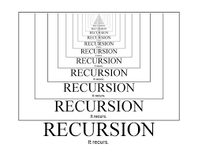

<h1 align="center">RECURSION</h1>

  

----

| Problems                  | Solution                         |
| -------------             |:-------------:                   |
| SUM OF NATURAL NUMBERS    | [SUM_OF_N_NATURAL_NO.PY](https://github.com/aditya-2703/DSA/blob/main/RECURSION/SUM_OF_N_NATURAL_NO.PY)                 | 
| FINDING EXPONENSIAL     | [EXPONENSIAL.PY](https://github.com/aditya-2703/DSA/blob/main/RECURSION/EXPONENSIAL.PY)              |
| FIND NO OF WAYS IN MATRIX    | [FIND_NO_OF_WAYS_IN_NxM.PY](https://github.com/aditya-2703/DSA/blob/main/RECURSION/FIND_NO_OF_WAYS_IN_NxM.PY)        |   
| JOSEPHUS PROBLEM | [JOSEPHUS_PROBLEM.PY](https://github.com/aditya-2703/DSA/blob/main/RECURSION/JOSEPHUS_PROBLEM.PY)     | 
| CHECKING PALINDROME STRING | [PALINDROME_STRING.PY](https://github.com/aditya-2703/DSA/blob/main/RECURSION/PALINDROME_STRING.PY)       |  
| PRINT ALL PERMUTATIONS OF STRING     | [PRINT_ALL_PERMUTATION_GIVEN_STRING.PY](https://github.com/aditya-2703/DSA/blob/main/RECURSION/PRINT_ALL_PERMUTATION_GIVEN_STRING.PY)        |  
| PRINT SUBSEQUENCES OF STRING    | [PRINT_SUBSEQUENCE_OF_GIVEN_STRING.PY](https://github.com/aditya-2703/DSA/blob/main/RECURSION/PRINT_SUBSEQUENCE_OF_GIVEN_STRING.PY)        |  
