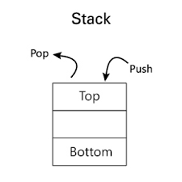

<h1 align="center">STACK</h1> 
  

| Problems                              | Solution                         | Platform                        |
| :-------------                        |:-------------                    |:-------------                   |
| STACK                                 | [Solution](https://github.com/aditya-2703/DSA/blob/main/STACK/STACK.py)                                   |  |
| STACK USING LINKED LIST               | [Solution](https://github.com/aditya-2703/DSA/blob/main/STACK/STACK_USING_LINKED_LIST.PY)                 | [GFG](https://www.geeksforgeeks.org/implement-a-stack-using-singly-linked-list/) |   
| MAXIMUM RECTANGULAR AREA IN HISTOGRAM | [Solution](https://github.com/aditya-2703/DSA/blob/main/STACK/Maximum_Rectangular_Area_in_a_Histogram.py) | [LEETCODE](https://leetcode.com/problems/largest-rectangle-in-histogram/) | 
| NEXT GREATER ELEMENT                  | [Solution](https://github.com/aditya-2703/DSA/blob/main/STACK/Next_Greater_Element.py)                    | [GFG](https://leetcode.com/problems/next-greater-element-i/) |  
| PARANTHESIS CHECKER                   | [Solution](https://github.com/aditya-2703/DSA/blob/main/STACK/Parenthesis_Checker.py)                     | [LEETCODE](https://leetcode.com/problems/valid-parentheses/) |  
| REVERSE A STRING USING STACK          | [Solution](https://github.com/aditya-2703/DSA/blob/main/STACK/Reverse_a_string_using_Stack.py)            | [GFG](https://www.geeksforgeeks.org/stack-set-3-reverse-string-using-stack/) |  
| REVERSE A STACK USING RECURSION       | [Solution](https://github.com/aditya-2703/DSA/blob/main/STACK/REVERSE_STACK.PY)                           | [GFG](https://www.geeksforgeeks.org/reverse-stack-without-using-extra-space/) |                  
| EVALUATION OF POSTFIX EXPRESSION      | [Solution](https://github.com/aditya-2703/DSA/blob/main/STACK/Evaluation_of_Postfix_Expression.py)        | [GFG](https://www.geeksforgeeks.org/stack-set-4-evaluation-postfix-expression/) |  
| INFIX TO POSTFIX                      | [Solution](https://github.com/aditya-2703/DSA/blob/main/STACK/INFIX_TO_POSTFIX.PY)                        | [GFG](https://www.geeksforgeeks.org/stack-set-2-infix-to-postfix/) |    
| REMOVE OUTERMOST PARANTHESIS          | [Solution](https://github.com/aditya-2703/DSA/blob/main/STACK/Remove_Outermost_Parentheses.py)            | [LEETCODE](https://leetcode.com/problems/remove-outermost-parentheses/) | 
| DUPLICATE PARANTHESIS                 | [Solution](https://github.com/aditya-2703/DSA/blob/main/STACK/DUPLICATE_PARA.PY)                          | [GFG](https://www.geeksforgeeks.org/find-expression-duplicate-parenthesis-not/) |    
| EASY STRING                           | [Solution](https://github.com/aditya-2703/DSA/blob/main/STACK/EASY_STRING.PY)                             | [GFG](https://practice.geeksforgeeks.org/problems/easy-string2212/1) | 
| MIN STACK O(N) SPACE                  | [Solution](https://github.com/aditya-2703/DSA/blob/main/STACK/MIN_STACK_1.PY)                             | [LEETCODE](https://leetcode.com/problems/min-stack/) |    
| MIN STACK O(1) SPACE                  | [Solution](https://github.com/aditya-2703/DSA/blob/main/STACK/MIN_STACK_2.PY)                             | [LEETCODE](https://leetcode.com/problems/min-stack/) | 
| SLIDING WINDOW MAXIMUM                | [Solution](https://github.com/aditya-2703/DSA/blob/main/STACK/SLIDING_WINDOW_MAX.PY)                      | [LEETCODE](https://leetcode.com/problems/sliding-window-maximum/) | 
| STOCK SPAN PROBLEM                    | [Solution](https://github.com/aditya-2703/DSA/blob/main/STACK/STOCK_SPAN.PY)                              | [LEETCODE](https://leetcode.com/problems/online-stock-span/) | 
   
