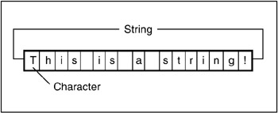

<h1 align="center">STRING</h1>

  

| Problems                                      | Solution                         | Platform                          | 
| :-------------                                 |:-------------                    | :-------------                   |
| ANAGRAM                                       | [Solution](https://github.com/aditya-2703/DSA/blob/main/STRING/ANAGRAM.PY)                       | [LEETCODE](https://leetcode.com/problems/valid-anagram/) |
| BINARY CHECK                                  | [Solution](https://github.com/aditya-2703/DSA/blob/main/STRING/BINARY_CHECK.PY)                  | [GFG](https://www.geeksforgeeks.org/check-binary-string-0-between-1s-not/) |   
| CONVERT TO ROMAN                              | [Solution](https://github.com/aditya-2703/DSA/blob/main/STRING/CONVERT_ROMAN.PY)                 | [GFG](https://www.geeksforgeeks.org/converting-decimal-number-lying-between-1-to-3999-to-roman-numerals/) | 
| ISOMORPHIC                                    | [Solution](https://github.com/aditya-2703/DSA/blob/main/STRING/ISOMORPHIC.PY)                    | [LEETCODE](https://leetcode.com/problems/isomorphic-strings/) |  
| KMP SOLUTION                                  | [Solution](https://github.com/aditya-2703/DSA/blob/main/STRING/KMP_SOLUTION.PY)                  | [GFG](https://www.geeksforgeeks.org/kmp-algorithm-for-pattern-searching/) |  
| LONGEST SUBSTRING WITHOUT REPEATING CHARACTER | [Solution](https://github.com/aditya-2703/DSA/blob/main/STRING/LONGEST_SUBSTRING_WITHOUT_REPE.PY)| [LEETCODE](https://leetcode.com/problems/longest-substring-without-repeating-characters/) |  
| NAIVE SOLUTION                                | [Solution](https://github.com/aditya-2703/DSA/blob/main/STRING/NAIVE_SOLUTION.PY)                | [GFG](https://www.geeksforgeeks.org/naive-algorithm-for-pattern-searching/) | 
| REVERSE WORD                                  | [Solution](https://github.com/aditya-2703/DSA/blob/main/STRING/REVERSE_WORD.PY)                  | [GFG](https://www.geeksforgeeks.org/reverse-words-in-a-given-string/) |   
| SUM LARGE INT                                 | [Solution](https://github.com/aditya-2703/DSA/blob/main/STRING/SUM_LARGE_INT.PY)                 | [GFG](https://www.geeksforgeeks.org/sum-two-large-numbers/#:~:text=1%20Reverse%20both%20strings.,3%20Finally%20reverse%20the%20result.) |  
| VALIDATE IP                                   | [Solution](https://github.com/aditya-2703/DSA/blob/main/STRING/VALIDATE_IP.PY)                   | [GFG](https://www.geeksforgeeks.org/program-generate-possible-valid-ip-addresses-given-string/#:~:text=A%20valid%20IP%20address%20must,25525511135%20Output%3A%20%5B%E2%80%9C255.255.) |    
