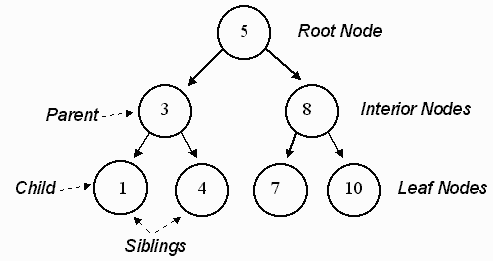

<h1 align="center">TREE</h1>

  

----

| Problems                  | Solution                         |
| -------------             |:-------------:                   |
| TREE CREATION     | [TREE_CREATION.PY](https://github.com/aditya-2703/DSA/blob/main/TREE/TREE_CREATION.PY)              |
| GENERIC TREE CREATION | [CONSTRUCTION_GENERIC_TREE.PY](https://github.com/aditya-2703/DSA/blob/main/TREE/CONSTRUCTION_GENERIC_TREE.PY)        |   
| GENERIC TREE CREATION 2.0 | [CONSTRUCTION_GENERIC_TREE2_2.0.PY](https://github.com/aditya-2703/DSA/blob/main/TREE/CONSTRUCTION_GENERIC_TREE2_2.0.PY)       |   
| DEPTHWISE GENERIC TREE TRAVERSAL | [DEPTH_GENERIC_TREE_TRAVERSAL.PY](https://github.com/aditya-2703/DSA/blob/main/TREE/DEPTH_GENERIC_TREE_TRAVERSAL.PY)        |   
| LEVELWISE GENERIC TREE TRAVERSAL | [LEVEL_GENERIC_TREE_TRAVERSAL.PY](https://github.com/aditya-2703/DSA/blob/main/TREE/LEVEL_GENERIC_TREE_TRAVERSAL.PY)        |   
| LEVEL LINEWISE GENERIC TREE TRAVERSAL | [LEVEL_LINEWISE_TREE_TRAVERSAL.PY](https://github.com/aditya-2703/DSA/blob/main/TREE/LEVEL_LINEWISE_TREE_TRAVERSAL.PY)        |   
| ZIG ZAG LINEWISE GENERIC TREE TRAVERSAL | [ZIG_ZAG_TRAVERSAL.PY](https://github.com/aditya-2703/DSA/blob/main/TREE/ZIG_ZAG_TRAVERSAL.PY)        |   
| MIRROR OF GENERIC TREE | [MIRROR_GENERIC_TREE.PY](https://github.com/aditya-2703/DSA/blob/main/TREE/MIRROR_GENERIC_TREE.PY)        |   
| MAXIMUM NODE FROM TREE | [MAX_FROM_TREE.PY](https://github.com/aditya-2703/DSA/blob/main/TREE/MAX_FROM_TREE.PY)        |   
| LINEARIZE GENERIC TREE | [LINEARIZE_GENERIC_TREE.PY](https://github.com/aditya-2703/DSA/blob/main/TREE/LINEARIZE_GENERIC_TREE.PY)        |   
| FIND ELEMENT IN GENERIC TREE | [FIND_ELEMENT_IN_GENERIC_TREE.PY](https://github.com/aditya-2703/DSA/blob/main/TREE/FIND_ELEMENT_IN_GENERIC_TREE.PY)        |   
| REMOVE LEAF NODES IN GENERIC TREE | [REM_LEAF_IN_GENERIC_TREE.PY](https://github.com/aditya-2703/DSA/blob/main/TREE/REM_LEAF_IN_GENERIC_TREE.PY)        |   
| NODE TO ROOT PATH GENERIC TREE | [NODE_TO_ROOT_PATH_GENERIC_TREE.PY](https://github.com/aditya-2703/DSA/blob/main/TREE/NODE_TO_ROOT_PATH_GENERIC_TREE.PY)        |   
| LOWEST COMMON ANCESTOR IN GENERIC TREE| [LOWEST_COMMON_ANCESTOR_GENERIC.PY](https://github.com/aditya-2703/DSA/blob/main/TREE/LOWEST_COMMON_ANCESTOR_GENERIC.PY)        |   
| DIFFERENCE BETWEEN TWO NODE IN GENERIC TREE | [DIFFERENCE_BET_TWO_NODE_GENERIC.PY](https://github.com/aditya-2703/DSA/blob/main/TREE/DIFFERENCE_BET_TWO_NODE_GENERIC.PY)        | 
| BINARY TREE CREATION     | [BINARY_TREE.CREATION.PY](https://github.com/aditya-2703/DSA/blob/main/TREE/BINARY_TREE.CREATION.py)     | 
| BINARY_TREE             | [BINARY_TREE.PY](https://github.com/aditya-2703/DSA/blob/main/TREE/BINARY_TREE.py)     | 
| AVL TREE    | [AVL_TREE.PY](https://github.com/aditya-2703/DSA/blob/main/TREE/AVL_TREE.PY)       |  
