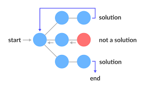

<h1 align="center">BACKTRACKING</h1>

  

----

| Problems                  | Solution                         |
| -------------             |:-------------:                   |
| FLOOD FILL ALGO     | [FLOOD_FILL.PY](https://github.com/aditya-2703/DSA/blob/main/backtraking/FLOOD_FILL.PY)              |
| TARGET SUBSET SUM     | [SUBSET_SUM_PROBLEM.PY](https://github.com/aditya-2703/DSA/blob/main/backtraking/SUBSET_SUM_PROBLEM.PY)              |
| N QUEEN PROBLEM     | [N_QUEEN_DP.PY](https://github.com/aditya-2703/DSA/blob/main/backtraking/N_QUEEN_DP.PY)              |
| KNIGHT TOUR     | [KNIGHT_TOUR.PY](https://github.com/aditya-2703/DSA/blob/main/backtraking/KNIGHT_TOUR.PY)              |
| SUDUKO SOLVER       | [SUDOKO.PY](https://github.com/aditya-2703/DSA/blob/main/backtraking/SUDOKO.PY)        |   
| TRAVELLING SALESMAN PROBLEM    | [Travelling_salesman_problem.PY](https://github.com/aditya-2703/DSA/blob/main/backtraking/Travelling_salesman_problem.py)     | 
