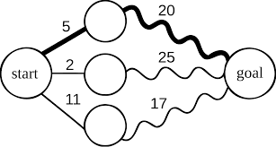

<h1 align="center">DYNAMIC PROGRAMMING</h1>

  

----

| Problems                  | Solution                         |
| -------------             |:-------------:                   |
| 01 KNAPSACK   | [01_knapsack_dyna.PY](https://github.com/aditya-2703/DSA/blob/main/dynamic_programming/01_knapsack_dyna.py)              |
| UNBOUNDED 01 KNAPSACK   | [UNBOUNDED_KNAPSACK.PY](https://github.com/aditya-2703/DSA/blob/main/dynamic_programming/UNBOUNDED_KNAPSACK.PY)              |
| ASSEMBLY LINE SHEDULAR          | [ASSEMBLY_LINE_SCHEDULAR.PY](https://github.com/aditya-2703/DSA/blob/main/dynamic_programming/ASSEMBLY_LINE_SCHEDULAR.PY)        |   
| BIONOMIAL    | [BIONOMIAL.PY](https://github.com/aditya-2703/DSA/blob/main/dynamic_programming/BIONOMIAL.PY)     | 
| DECODE STRING WAYS DP APPROACH    | [DECODE_STRINGS_WAYS_DP.PY](https://github.com/aditya-2703/DSA/blob/main/dynamic_programming/DECODE_STRINGS_WAYS._DP.py)       |  
| EDIT DISTANCE BETWEEN TWO STRING DP APPROACH | [EDIT_DISTANCE_BET2STRING_DP.PY](https://github.com/aditya-2703/DSA/blob/main/dynamic_programming/EDIT_DISTANCE_BET2STRING_DP.py)        |
| LONGEST COMMON SUBSEQUENCE DP APPROACH    | [LONG_COM_SUB_DP.PY](https://github.com/aditya-2703/DSA/blob/main/dynamic_programming/LONG_COM_SUB_DP.py)                       |    | MAKING CHAIN PROBLEM          | [MAKING_CHAIN.PY](https://github.com/aditya-2703/DSA/blob/main/dynamic_programming/MAKING_CHAIN.PY)        |   
| SUBSET SUM PROBLEM          | [SUBSET_SUM_PROBLEM.PY](https://github.com/aditya-2703/DSA/blob/main/dynamic_programming/SUBSET_SUM_PROBLEM.PY)        |   
| MIN PATH SUM PROBLEM          | [MIN_PATH_SUM.PY](https://github.com/aditya-2703/DSA/blob/main/dynamic_programming/MIN_PATH_SUM.PY)        |   
| CLIMB STAIRS PROBLEM          | [CLIMB_STAIRS.PY](https://github.com/aditya-2703/DSA/blob/main/dynamic_programming/CLIMB_STAIRS.PY)        |   
| CLIMB STAIRS WITH JUMP        | [CLIMB_STAIRS_WITH_JUMP.PY](https://github.com/aditya-2703/DSA/blob/main/dynamic_programming/CLIMB_STAIRS_WITH_JUMP.PY)        |   
| CLIMB STAIRS WITH MIN JUMP    | [CLIMB_STAIRS_WITH_MIN_JUMP.PY](https://github.com/aditya-2703/DSA/blob/main/dynamic_programming/CLIMB_STAIRS_WITH_MIN_JUMP.PY)        |   
| MOST COST CLIMB STAIRS        | [MOST_COST_CLIMBING_STAIRS.PY](https://github.com/aditya-2703/DSA/blob/main/dynamic_programming/MOST_COST_CLIMBING_STAIRS.PY)        |   
| GOLDMINE DIG PROBLEM          | [GOLDMINE_DIG.PY](https://github.com/aditya-2703/DSA/blob/main/dynamic_programming/GOLDMINE_DIG.PY)        |   
| COIN CHANGE PERMUTATION       | [COIN_CHANGE_PERMUTATIONS.PY](https://github.com/aditya-2703/DSA/blob/main/dynamic_programming/COIN_CHANGE_PERMUTATIONS.PY)        |   
| COIN CHANGE COMBINATIONS      | [COIN_CHANGE_COMBINATIONS.PY](https://github.com/aditya-2703/DSA/blob/main/dynamic_programming/COIN_CHANGE_COMBINATIONS.PY)        |   
| DECODE WAYS| [DECODE_WAYS.PY](https://github.com/aditya-2703/DSA/blob/main/dynamic_programming/DECODE_WAYS.PY)     | 
| COUNT BINARY STRING | [COUNT_BIN_STR.PY](https://github.com/aditya-2703/DSA/blob/main/dynamic_programming/COUNT_BIN_STR.PY)     | 
| ARRANGE THE BUILDING | [ARRANGE_BUILDING.PY](https://github.com/aditya-2703/DSA/blob/main/dynamic_programming/ARRANGE_BUILDING.PY)     | 
| COUNT SUBSEQUENCE OF A+B+C | [COUNT_SUBSEQUENCE_ABC.PY](https://github.com/aditya-2703/DSA/blob/main/dynamic_programming/COUNT_SUBSEQUENCE_ABC.PY)     | 
| MAX SUM OF TWO NON ADJUCENT | [SUM_OF_TWO_NON_ADJACENT.PY](https://github.com/aditya-2703/DSA/blob/main/dynamic_programming/SUM_OF_TWO_NON_ADJACENT.PY)     | 
| PAINT HOUSE  | [PAINT_HOUSE.PY](https://github.com/aditya-2703/DSA/blob/main/dynamic_programming/PAINT_HOUSE.PY)     | 
| PAINT HOUSE 2 | [PAINT_HOUSE_2.PY](https://github.com/aditya-2703/DSA/blob/main/dynamic_programming/PAINT_HOUSE_2.PY)     | 
| MATRIX SUM RECTANGLE| [MATRIX_SUM_REC.PY](https://github.com/aditya-2703/DSA/blob/main/dynamic_programming/MATRIX_SUM_REC.py)     | 
| RANGE QUERY SUM PROBLEM    | [RANGE_QUERY.PY](https://github.com/aditya-2703/DSA/blob/main/dynamic_programming/RANGE_QUERY.py)       |  
| STAIR CASE PROBLEM WITH  DP APPROACH|[STAIR_DP_BOTTOMUP.PY](https://github.com/aditya-2703/DSA/blob/main/dynamic_programming/STAIR_DP_BOTTOMUP.py)        |  
| TOTAL COUNT BINARY SEARCH TREE | [TOTAL_COUNT_BST.PY](https://github.com/aditya-2703/DSA/blob/main/dynamic_programming/TOTAL_COUNT_BST.py)        |  
| COIN CHANGE PROBLEM WITH DP APPROACH| [choinchange.PY](https://github.com/aditya-2703/DSA/blob/main/dynamic_programming/coinchange.py)                 | 
| EGG DROPPING WITH DP APPROACH| [egg_droping.py](https://github.com/aditya-2703/DSA/blob/main/dynamic_programming/egg_droping.py)                 |   
| EGG DROPPING WITH DP APPROACH WITH SECOND APPROACH        | [egg_dropping_diff.PY](https://github.com/aditya-2703/DSA/blob/main/dynamic_programming/egg_droping_diff.py)                   |  
| FIBONACCI SEQUENCE    | [fibonacci.PY](https://github.com/aditya-2703/DSA/blob/main/dynamic_programming/fibonacci.py)                       |    
| FIND NEXT PERMUTATION        | [next_permutation.PY](https://github.com/aditya-2703/DSA/blob/main/dynamic_programming/next_permutaion.py)                   |  
| PASCAL TRIANGLE    | [pascal.PY](https://github.com/aditya-2703/DSA/blob/main/dynamic_programming/pascal.py)                       |    
