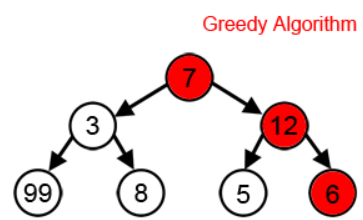

<h1 align="center">GREEDY</h1>

  

----

| Problems                  | Solution                         |
| -------------             |:-------------:                   |
| 01 KNAPSACK PROBLEM     | [01_knapsach_recursion.PY](https://github.com/aditya-2703/DSA/blob/main/greedy/01_knapsack_recursion.py)              |
| CONNECTED COMPONENT PROBLEM   | [CONNECTED_COMPONENT.PY](https://github.com/aditya-2703/DSA/blob/main/greedy/CONNECTED_COMPONENT.PY)        |   
| DECODE STRING WAYS PROBLEM| [DECODE_STRINGS_WAYS.PY](https://github.com/aditya-2703/DSA/blob/main/greedy/DECODE_STRINGS_WAYS.py)     | 
| LONGEST COMMON SUBSEQUENCE| [EDIT_DISTANCE_BET2STRING.PY](https://github.com/aditya-2703/DSA/blob/main/greedy/EDIT_DISTANCE_BET2STRING.py)       |  
| OPEN PARANTHESIS PROBLEM | [LONG_COM_SUB.PY](https://github.com/aditya-2703/DSA/blob/main/greedy/LONG_COM_SUB.PY)        |  
| PARTITION SET K SUM    | [OPNE_PARANTHESIS_PROBLME.PY](https://github.com/aditya-2703/DSA/blob/main/greedy/OPNE_PARENTHESIS_PROBLME.py)        |  
| STAIR CASE PROBLEM | [PARTITION_SET_K_SUM.PY](https://github.com/aditya-2703/DSA/blob/main/greedy/PARTITION_SET_K_SUM.py)                 | 
| EDIT DISTANCE BETWEEN TWO STRINGS| [STAIR_RECUR.py](https://github.com/aditya-2703/DSA/blob/main/greedy/STAIR_RECUR.py)                 |   
